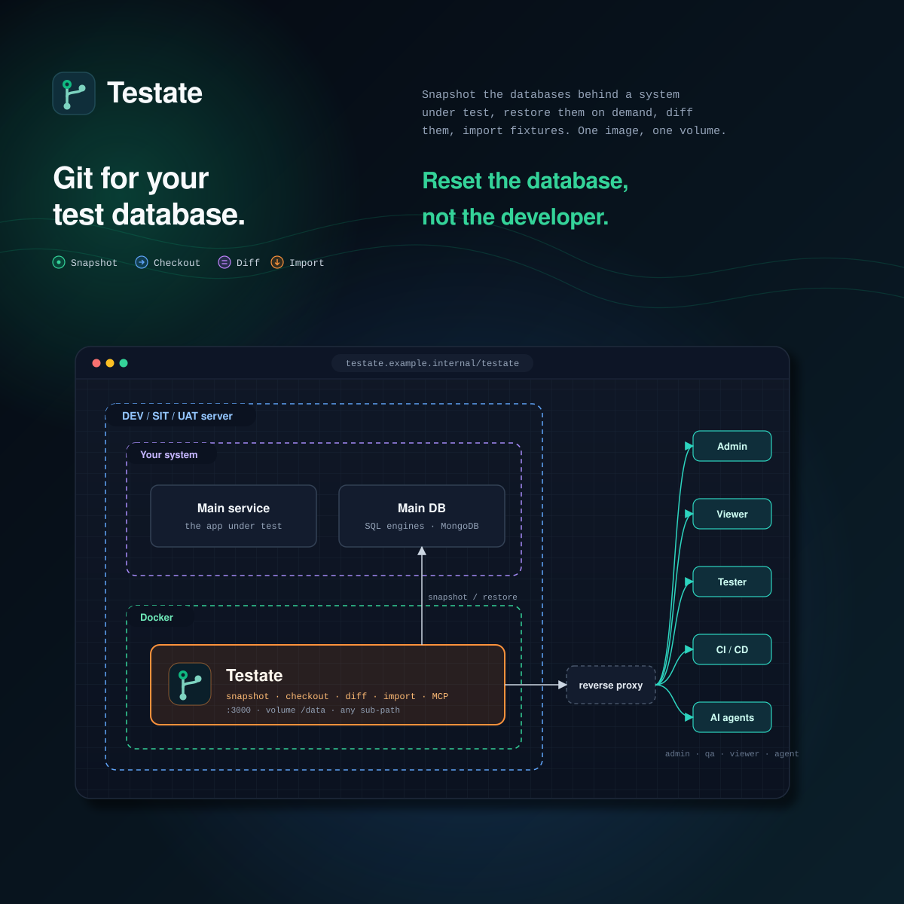

**Git for your test database. Reset the database, not the developer.**

Testate is a self-hosted tool for QA teams. It takes data-only snapshots ("states") of the databases behind a system under test, restores them on demand, diffs them, imports fixtures, and lets an AI agent inspect them read-only. One Docker image, one volume, any sub-path.

| Tier     | Engines                    | What you get                                          |
| -------- | -------------------------- | ----------------------------------------------------- |
| Tabular  | PostgreSQL, MySQL, MariaDB | view, snapshot, checkout, diff, extract, edit, import |
| Document | MongoDB                    | view, snapshot, checkout, diff, extract               |
| Files    | S3, SFTP, FTP              | view, download                                        |
| REST     | any HTTP API               | saved requests, hooks around checkouts                |

REST adapters hold no data of their own. They store the requests you save and the hooks that run around a checkout.

## Status

Version 1.0.0-alpha. Every engine in the table is real, not a stand-in. The gate — type-check, lint, format, unit tests, build — runs on every push, and a browser suite covers all 150 user stories, each one tagged with the story it proves. `docs/api-specs/_index.md` lists every operation.

## Run it

```sh
cp deploy/.env.example deploy/.env
bun scripts/generate-key.ts        # paste into TESTATE_SECRETS_ACTIVE_KEY
# set TESTATE_ADMIN_PASSWORD
docker compose -f deploy/docker-compose.yml up -d
open http://localhost:3000
```

Sign in as `admin`. The first login forces a password change. Create users under **Users**; roles are `viewer` < `qa` < `admin`.

The image is `ghcr.io/pt-perkasa-pilar-utama/testate`, built from `deploy/Dockerfile` and slimmed with docker-slim by the manual **Deploy image** workflow. To publish: run `bun run bump-version <version>`, then run the workflow. It publishes `<version>` and `latest`, and skips a version that is already there.

Serve under a sub-path by setting `TESTATE_BASE_PATH=/testate`. `deploy/nginx.conf` shows the proxy block.

### Forgot a password

An admin resets any account to a temporary password under **Users**. The owner must change it at the next login.

Nobody can reset the last admin, so that one recovers through the environment. Restart the container with `TESTATE_ADMIN_PASSWORD_RESET=true` and a new `TESTATE_ADMIN_PASSWORD`. That account gets the password, must change it at the next login, and loses every session it had. Then remove the variable: while it is set, every restart resets that password again.

## What it does not do

**It only resets the databases you add to it.** If your app also writes somewhere Testate does not track, a reset puts one side back to the snapshot and leaves the other where it is. The app then reads rows that no longer match. Testate cannot warn you here — it has never heard of that database. Put every database your app writes to in one project, and snapshot them together: one snapshot covers every database in a project, and one checkout restores them all.

**Databases go one at a time, not together.** Even in one project, Testate snapshots and restores them one after another. Each database is correct on its own, but the set is not guaranteed to line up, and one restore can fail while another succeeds. Keep the app idle while you snapshot or reset.

**It has to reach the database from inside a container.** A database on another server needs a route, an open firewall, and a login. A database installed straight onto the same machine needs the same care: inside the container, `127.0.0.1` means the container. Point the adapter at `host.docker.internal` — the compose file carries the line, commented out — and let the database listen on that interface. If Testate cannot reach a database, you cannot add it, so a reset will skip it and you are back to the first problem.

**A snapshot has no owner.** Two testers sharing one database share everything: either can reset it, and the other's work goes without a warning. Two projects on the same database is worse, because Testate sees two unrelated adapters — their jobs are not kept apart, and each takes its own starting snapshot at a different moment. One database, one project, one tester at a time. When you point an adapter at a database another project already tracks, the connection test says so.

**It needs a real database connection.** Testate has to speak the database's own protocol, read every table at one moment, and be allowed to empty and refill tables inside one transaction. Firebase, Firestore and DynamoDB offer none of that — you reach them through an SDK, not a connection, so they cannot be added. Hosted PostgreSQL and MySQL are ordinary targets whoever runs them: Supabase, Neon, RDS, Cloud SQL. On Supabase, use the direct connection rather than the pooler, with a role that owns the tables; otherwise the reset is refused.

**It resets databases and nothing else.** Caches, queues, and whatever a running service holds in memory are left alone, so a service can go on serving rows the database no longer has. Attach a saved request to the `before_checkout` and `after_checkout` hooks to pause a service and clear its cache around the reset.

### Microservices

Not supported yet, and untested. Every limit above compounds: each service owns a database, the services reference each other by id, and Testate resets one database at a time with no shared transaction and no order between them. Two services sharing a database hit the owner problem, and nothing clears the caches in between.

You can still get real use out of it by staying inside one service at a time. Add the databases you do not want touched as **read-only** adapters:

| Works on a read-only adapter                      | Refused                   |
| ------------------------------------------------- | ------------------------- |
| Browse tables, run read queries, save them        | Checkout and reset        |
| Take snapshots and diff them against live         | Import fixtures           |
| Extract a row and its related rows as SQL or JSON | Edit rows, write sessions |
| Let an AI agent read it over MCP                  |                           |

That gives one place to look at data across every service, with no way to break anything. Give the service under test a normal sandbox adapter in its own project, snapshot it, run, reset. Deleting a project leaves read-only adapters alone, so the safe ones stay safe.

## Develop

Requires [Bun](https://bun.sh) 1.4.

```sh
bun install
docker compose -f deploy/compose.engines.yml up -d   # optional target engines
cp deploy/.env.example .env                          # TESTATE_ENV=development, TESTATE_DATA_DIR=./data
bun run dev                                          # API on :3000, Vite on :5173
```

The first boot needs `TESTATE_ADMIN_PASSWORD`; the first login forces a change. Outside production, `POST /api/v1/admin/reset-state` (admin, body `{"confirm":"reset"}`) wipes the metadata, recreates the admin from the environment, and ends every session, yours included.

| Command                  | Does                                                       |
| ------------------------ | ---------------------------------------------------------- |
| `bun run complete-check` | type-check, lint, format check, tests, build. The CI gate. |
| `bun test`               | unit and contract tests                                    |
| `bun run e2e`            | the browser suite; needs the compose engines up            |
| `bun run smoke`          | health checks against a running API (`SMOKE_BASE_URL`)     |
| `bun run bump-version`   | set the version everywhere at once                         |
| `bun run generate-key`   | a new sealed-values key                                    |

Docs live in `docs/`: the [PRD](docs/PRD.md), the [technical specs](docs/technical-specs/_index.md), the [API specs](docs/api-specs/_index.md), the [coding standard](docs/CODING_STANDARD.md), [key rotation](docs/KEY_ROTATION.md), [agent access](docs/AGENT_ACCESS.md), the [deployment plan](docs/DEPLOYMENT_PLAN.md), and the [browser suite](docs/E2E.md).

## Layout

```text
apps/api        Bun + Hono API; one vertical module per resource (router, handler, service, mock, test)
apps/web        SolidJS 2 SPA; one feature per resource (model, presenter, view); Kumo components
packages/shared valibot schemas: the contract both apps derive their types from
deploy          Dockerfile, compose, nginx, engines for development
docs            PRD, specs, ADRs, standards
```

## License

MIT. Copyright PT. Perkasa Pilar Utama.
