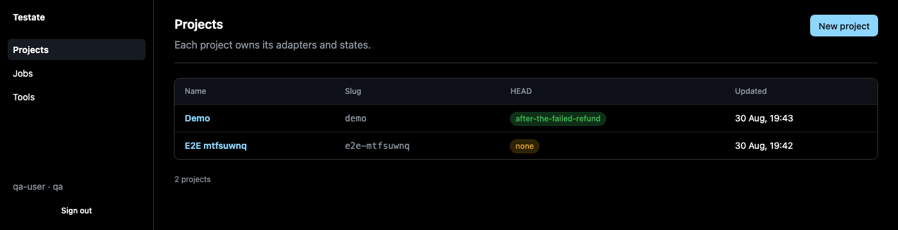
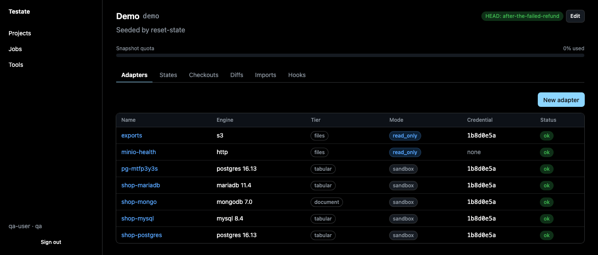
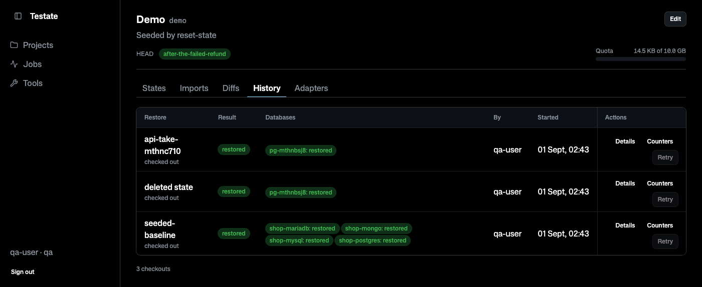
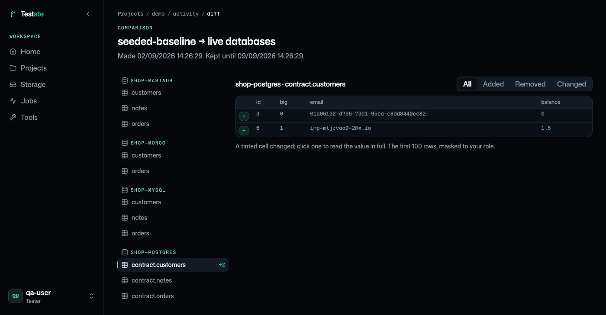
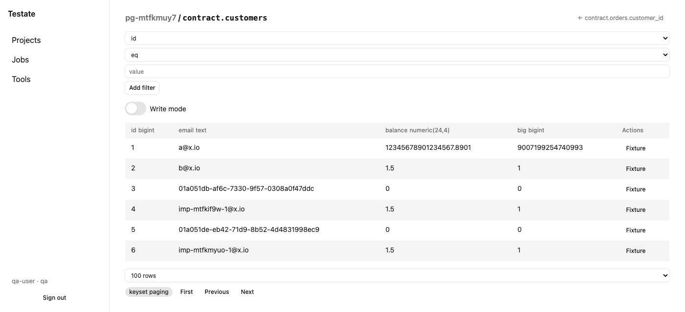
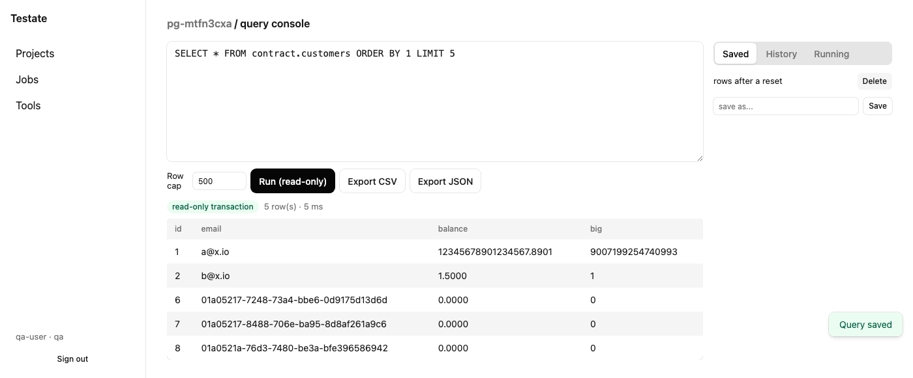
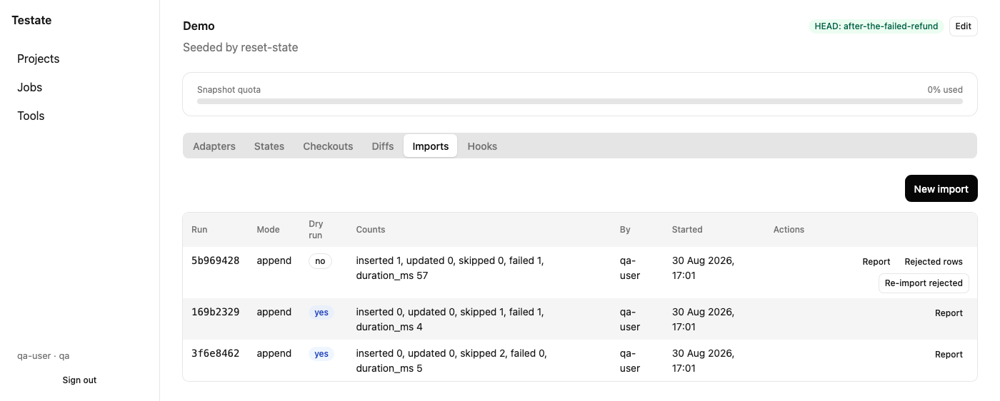

**Git for your test database. Reset the database, not the developer.**

Testate is a self-hosted tool for QA teams. It takes data-only snapshots ("states") of the databases behind a system under test, restores them on demand, diffs them, imports fixtures, and lets an AI agent inspect them read-only. One Docker image, one volume, any sub-path.

| Tier     | Engines                    | What you get                                          |
| -------- | -------------------------- | ----------------------------------------------------- |
| Tabular  | PostgreSQL, MySQL, MariaDB | view, snapshot, checkout, diff, extract, edit, import |
| Document | MongoDB                    | view, snapshot, checkout, diff, extract               |
| Files    | S3, SFTP, FTP              | view, download                                        |
| REST     | any HTTP API               | saved requests, hooks around checkouts                |

REST adapters hold no data of their own. They store the requests you save and the hooks that run around a checkout. Version 1.0.0-alpha. Every engine in the table is real, not a stand-in.

## Quick start

One container, no configuration file, to see what it does:

```sh
docker run -d --name testate -p 3000:3000 -v testate-data:/data \
  -e TESTATE_SECRETS_ACTIVE_KEY="$(openssl rand -base64 32)" \
  -e TESTATE_ADMIN_PASSWORD=change-me-now-1234 \
  ghcr.io/pt-perkasa-pilar-utama/testate:1.0.1-alpha
```

Open <http://localhost:3000> and sign in as `admin` with that password. Testate makes you change it on the first login.

From there: add a database under **Adapters**, take a snapshot under **States**, break something, then put it back under **Checkouts**. Where to point the host is the one thing that catches people out, so read [section 3](#3-connecting-to-a-database) before you add the adapter.

That command keeps everything in one Docker volume and is fine for a look. For anything you rely on, use Compose and an `.env` file: [How to install](#1-how-to-install).

## Contents

- [Quick start](#quick-start)
- [What you get](#what-you-get)
- [1. How to install](#1-how-to-install)
- [2. First-time setup](#2-first-time-setup)
- [3. Connecting to a database](#3-connecting-to-a-database)
  - [3a. A database running in Docker, on the same machine as Testate](#3a-a-database-running-in-docker-on-the-same-machine-as-testate)
  - [3b. A database running as a native binary on the host](#3b-a-database-running-as-a-native-binary-on-the-host)
  - [3c. A database in the cloud (managed or remote)](#3c-a-database-in-the-cloud-managed-or-remote)
- [4. How to test the connection](#4-how-to-test-the-connection)
- [5. How to connect an AI agent to a project](#5-how-to-connect-an-ai-agent-to-a-project)
- [6. How to integrate into a CI/CD pipeline](#6-how-to-integrate-into-a-cicd-pipeline)
- [What it does not do](#what-it-does-not-do)
  - [Microservices](#microservices)
- [Upgrading, backups, and operating it](#upgrading-backups-and-operating-it)
- [Developing Testate](#developing-testate)
- [Docs](#docs)
- [License](#license)

## What you get

**Start with a project per system under test.** It owns the databases behind that system, the
states you take of them, and everything you do to them.



**Point it at the databases behind the system under test.** Each adapter reports its engine and
version, what your login is allowed to do, and whether the database is safe to reset. Object storage
and REST endpoints sit in the same list.



**Snapshot them.** A state is data only, taken across every database in the project at once, and it
says who took it and what it cost.


**Put them back.** A checkout restores the state you pick and reports what happened per database.



**See what a test run changed.** Diff two states, or a state against the live database, and drill
into the rows.



**Read and edit the rows.** Filter, page by keyset, follow a foreign key, or turn on write mode and
edit a row with the types the column actually has.



**Run your own SQL.** A read-only console with saved queries, so the check you run after every
reset is one click away.



**Load fixtures.** Upload a CSV or XLSX, map the columns, dry-run it, then import for real.



**Let an agent look.** Testate speaks MCP, so Claude or any agent can read schemas, page rows, run
read-only queries, and read your snapshots. The token it uses reaches nothing but `/mcp`, and it
cannot write.

## 1. How to install

Requirements: Docker 24 or later with Compose v2, 1 CPU and 1 GiB RAM minimum, a volume for `/data`, and outbound network access from the host to every database, file store, and REST host you plan to connect.

```sh
mkdir -p /opt/testate && cd /opt/testate
curl -O https://raw.githubusercontent.com/PT-Perkasa-Pilar-Utama/testate/main/deploy/docker-compose.yml
curl -o .env https://raw.githubusercontent.com/PT-Perkasa-Pilar-Utama/testate/main/deploy/.env.example
```

Generate a sealing key and put it in `.env`:

```sh
openssl rand -base64 32
```

Paste the output into `TESTATE_SECRETS_ACTIVE_KEY=` in `.env`. Then set `TESTATE_ADMIN_PASSWORD` (see step 2), and `TESTATE_PUBLIC_URL` to the address you will reach Testate at.

```sh
docker compose up -d
docker compose logs -f testate   # wait for the boot line
```

Testate listens on port 3000 inside the container; `docker-compose.yml` publishes it as `3000:3000`. All state lives on the `testate-data` volume, mounted at `/data` (`metadata.db`, blobs, logs, uploads). The container filesystem is otherwise read-only.

To serve Testate under a sub-path instead of the domain root, set `TESTATE_BASE_PATH=/testate` (leading slash, no trailing slash) and restart. `deploy/nginx.conf` is a matching reverse-proxy example.

## 2. First-time setup

Open the address you set as `TESTATE_PUBLIC_URL` (or `http://<host>:3000` with no proxy in front).

The admin account comes from the environment on first boot only. `TESTATE_ADMIN_PASSWORD` is read while the users table is empty; once one user exists, Testate ignores it. Sign in as `TESTATE_ADMIN_USER` (default `admin`) with that password. The first login forces a password change. After that, remove `TESTATE_ADMIN_PASSWORD` from `.env`. It has no further effect, and there is no reason to leave a plaintext password sitting in the file.

Create the rest of your users under **Users**. Roles are cumulative: `viewer` < `qa` < `admin`. Only an admin can create users, tokens, and change settings.

If the last admin forgets their password, nobody else can reset it from the dashboard. Recovery is `TESTATE_ADMIN_PASSWORD_RESET=true` plus a new `TESTATE_ADMIN_PASSWORD` in `.env`, then a restart. See "Forgotten password" in [docs/DEPLOYMENT_PLAN.md](docs/DEPLOYMENT_PLAN.md).

## 3. Connecting to a database

Open a project, go to **Adapters**, and click **New adapter**. For a database engine (PostgreSQL, MySQL, MariaDB, MongoDB) the form asks for Host, Port, Database, User, and Password. Where you point "Host" depends on where the database actually runs.

Testate connects out to the database from inside its own container. `127.0.0.1` or `localhost` in that form means the Testate container itself, never the machine it runs on. The default address deny list also blocks `127.0.0.0/8` and `::1/128` outright, so a loopback address will not connect even by accident.

### 3a. A database running in Docker, on the same machine as Testate

Put both containers on the same Docker network, then use the target container's name as the host and its **internal** port, not the port it publishes to the host.

```sh
docker ps --format '{{.Names}}'                        # find the two container names
docker network create testate-net
docker network connect testate-net <testate-container>       # e.g. testate-testate-1
docker network connect testate-net <your-db-container>       # e.g. shop-postgres
```

Once connected, a container's own name is its DNS name on that network. Adapter form: Host `<your-db-container>`, Port `5432` (Postgres's own port inside the container, not whatever you mapped it to on the host).

### 3b. A database running as a native binary on the host

Uncomment `extra_hosts` in `deploy/docker-compose.yml` and restart:

```yaml
services:
  testate:
    extra_hosts:
      - "host.docker.internal:host-gateway"
```

Adapter form: Host `host.docker.internal`, Port whatever the native process listens on (`5432` for a default Postgres install). The database must also listen on that interface. A Postgres bound only to `127.0.0.1` in `postgresql.conf` is unreachable from the container even with `extra_hosts` set; bind it to `0.0.0.0` or the Docker bridge address instead.

### 3c. A database in the cloud (managed or remote)

Adapter form: Host is the provider's address or DNS name, Port its usual port. Nothing extra to configure on the Testate side beyond a route from the host running Testate to that address (an open firewall, a VPN, a public endpoint, whatever your provider needs).

On Supabase specifically, use the direct connection string, not the pooler, and a role that owns the tables. The pooler refuses the transaction shape a restore needs.

## 4. How to test the connection

Before saving, click **Test connection** in the New adapter dialog. Testate opens the connection with the values in the form, reports the engine and version, whether it meets the minimum supported version, its capabilities (can it truncate, disable triggers, run inside one transaction), and any warnings. Nothing is written until you click **Create**; the test is a dry run.

A blocked or unreachable host fails here with the reason (address policy, authentication, timeout), before you commit to a broken adapter.

Once an adapter is saved, `POST /api/v1/projects/{slug}/adapters/{id}/retest` re-runs the same probe with the stored credentials. This is useful after a password rotation or a privilege change on the database side. There is no retest button in the dashboard yet; call the endpoint directly with a `qa` or `admin` token.

## 5. How to connect an AI agent to a project

Testate exposes a read-only MCP (Model Context Protocol) endpoint so an agent can inspect a project's databases without ever getting a write path.

1. As an admin, open **Tokens** and create a token of kind **agent**. Choose a name, a project scope, and an expiry (default 90 days, maximum 365).
2. Copy the token: Testate shows it once. Give the agent the endpoint and the token.

Claude Code:

```sh
claude mcp add --transport http testate https://testate.example.internal/api/v1/mcp \
  --header "Authorization: Bearer tst_agent_..."
```

With a sub-path: `https://example.internal/testate/api/v1/mcp`.

Any MCP client:

```json
{
  "mcpServers": {
    "testate": {
      "type": "http",
      "url": "https://testate.example.internal/api/v1/mcp",
      "headers": { "Authorization": "Bearer tst_agent_..." }
    }
  }
}
```

What the agent can reach: an agent token is accepted only on `/api/v1/mcp`; every other route answers `403`. On that endpoint it gets read-only tools: `list_projects`, `list_adapters`, `list_tables`, `describe_table`, `page_rows`, `get_row`, `run_readonly_query`, `extract_fixture`, `list_states`, `get_state`, `diff_summary`, `list_files`, `preview_file`. They are capped at 200 rows a page (1000 max), 1 MiB a result, 15 seconds a query. Column policies mask sensitive values before the agent ever sees them; there is no unmask option and no write tool. Every call is audited with the tool name, an argument hash, the project, the adapter, and the outcome.

Full detail: [docs/AGENT_ACCESS.md](docs/AGENT_ACCESS.md).

## 6. How to integrate into a CI/CD pipeline

The full REST API is available for automation; nothing here is dashboard-only. The endpoint matrix (every resource, its operations, and their status) lives in [docs/api-specs/_index.md](docs/api-specs/_index.md), with one detail document per resource alongside it. A live, generated copy of the same contract is served at `GET /api/v1/openapi.json` from a running instance.

**Authentication.** Create a token under **Tokens** (or `POST /api/v1/tokens`, admin only) with kind `standard` and a role. `qa` can run checkouts, imports, and snapshots; `viewer` can only read. Send it as `Authorization: Bearer tst_<token>`. There is no cookie and no CSRF header to add; those apply to the dashboard's own session only.

**Example: reset the database before a test run.** `POST /projects/{slug}/checkouts` restores a named state. Story 113 in the product's own backlog calls this out as the CI entry point. `wait` blocks the request until the job finishes or the given number of seconds pass (1 to 300), but a `202` (still running) is still a successful HTTP call, and a finished job can still have `status: "failed"`. Gate the pipeline step on the job's `status`, not on the HTTP code:

```sh
JOB=$(curl -sf -X POST "$TESTATE_URL/api/v1/projects/shop/checkouts" \
  -H "Authorization: Bearer $TESTATE_TOKEN" -H "Content-Type: application/json" \
  -d '{"state_name": "seeded-baseline"}')
JOB_ID=$(echo "$JOB" | jq -r '.data.job.id')
STATUS=$(echo "$JOB" | jq -r '.data.job.status')

while [ "$STATUS" != "succeeded" ] && [ "$STATUS" != "failed" ] && [ "$STATUS" != "partial" ] \
      && [ "$STATUS" != "cancelled" ] && [ "$STATUS" != "interrupted" ]; do
  sleep 3
  STATUS=$(curl -sf "$TESTATE_URL/api/v1/jobs/$JOB_ID?wait=30" \
    -H "Authorization: Bearer $TESTATE_TOKEN" | jq -r '.data.status')
done

[ "$STATUS" = "succeeded" ] || { echo "checkout ended in status: $STATUS" >&2; exit 1; }
```

Every job-creating `POST` also accepts an `Idempotency-Key` header, so a retried CI step after a network blip does not trigger a second restore.

## What it does not do

| Limit                                                | What happens                                                                                                                                                                                                                                                          | What to do about it                                                                                                                                                                                    |
| ---------------------------------------------------- | --------------------------------------------------------------------------------------------------------------------------------------------------------------------------------------------------------------------------------------------------------------------- | ------------------------------------------------------------------------------------------------------------------------------------------------------------------------------------------------------ |
| It only resets the databases you add to it           | An untracked database is left behind by a reset, and Testate cannot warn you. It has never heard of that database. The app then reads rows that no longer match.                                                                                                      | Put every database your app writes to in one project. One snapshot covers every database in a project, and one checkout restores them all.                                                             |
| Databases go one at a time, not together             | Even in one project, Testate snapshots and restores databases one after another. Each one is correct on its own, but the set is not guaranteed to line up. One restore can fail while another succeeds.                                                               | Keep the app idle while you snapshot or reset.                                                                                                                                                         |
| It has to reach the database from inside a container | A database on another server needs a route, an open firewall, and a login. Inside the container, `127.0.0.1` means the container, not the host. If Testate cannot reach a database, you cannot add it, so a reset skips it.                                           | Point the adapter at the host or container name that is actually reachable; see section 3 above.                                                                                                       |
| A snapshot has no owner                              | Two testers sharing one database share everything: either can reset it, and the other's work goes without a warning. Two projects on one database is worse: two unrelated adapters, jobs not kept apart, each taking its own starting snapshot at a different moment. | Run one database, one project, one tester at a time. The connection test warns you when another project already tracks that database.                                                                  |
| It needs a real database connection                  | Testate has to speak the database's own protocol, read every table at one moment, and be allowed to empty and refill tables inside one transaction. Firebase, Firestore, and DynamoDB give you an SDK rather than a connection, so you cannot add them.               | Use an ordinary target instead: Supabase, Neon, RDS, and Cloud SQL all work. On Supabase, use the direct connection rather than the pooler, with a role that owns the tables, or the reset is refused. |
| It resets databases and nothing else                 | Caches, queues, and whatever a running service holds in memory stay untouched, so a service can go on serving rows the database no longer has.                                                                                                                        | Attach a saved request to the `before_checkout` and `after_checkout` hooks to pause the service and clear its cache around the reset.                                                                  |

### Microservices

Not supported yet, and untested. Every limit above compounds: each service owns a database, the services reference each other by id, and Testate resets one database at a time with no shared transaction and no order between them. Two services sharing a database hit the owner problem, and nothing clears the caches in between.

You can still get real use out of it by staying inside one service at a time. Add the databases you do not want touched as **read-only** adapters:

| Works on a read-only adapter                      | Refused                   |
| ------------------------------------------------- | ------------------------- |
| Browse tables, run read queries, save them        | Checkout and reset        |
| Take snapshots and diff them against live         | Import fixtures           |
| Extract a row and its related rows as SQL or JSON | Edit rows, write sessions |
| Let an AI agent read it over MCP                  |                           |

That gives one place to look at data across every service, with no way to break anything. Give the service under test a normal sandbox adapter in its own project, snapshot it, run, reset. Deleting a project leaves read-only adapters alone, so the safe ones stay safe.

## Upgrading, backups, and operating it

Pulling a new image, rolling back a failed migration, scheduling backups, and rotating the sealing key are all covered in [docs/DEPLOYMENT_PLAN.md](docs/DEPLOYMENT_PLAN.md) and [docs/KEY_ROTATION.md](docs/KEY_ROTATION.md).

## Developing Testate

If you want to build or change Testate itself rather than run it, start at [CLAUDE.md](CLAUDE.md) for the commands, layout, and conventions.

To run it from source rather than from the image:

```sh
bun install
cp apps/api/.env.example apps/api/.env
bun scripts/generate-key.ts          # paste into TESTATE_SECRETS_ACTIVE_KEY
# set TESTATE_ADMIN_PASSWORD too, then:
bun run dev                          # API on :3000, web on :5173
```

The file belongs in `apps/api/`, not the repo root. Bun reads `.env` from the working directory and does not look upwards, and `bun run dev` starts the API with `apps/api` as its working directory. `deploy/.env.example` is the container's version of the same variables and is wrong for a source run: it points `TESTATE_DATA_DIR` at `/data`.

## Docs

Docs live in `docs/`: the [PRD](docs/PRD.md), the [technical specs](docs/technical-specs/_index.md), the [API specs](docs/api-specs/_index.md), [agent access](docs/AGENT_ACCESS.md), the [deployment plan](docs/DEPLOYMENT_PLAN.md), and [key rotation](docs/KEY_ROTATION.md).

## License

MIT. Copyright PT. Perkasa Pilar Utama.
