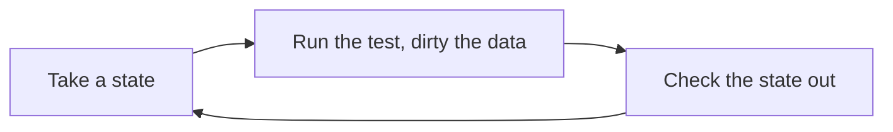
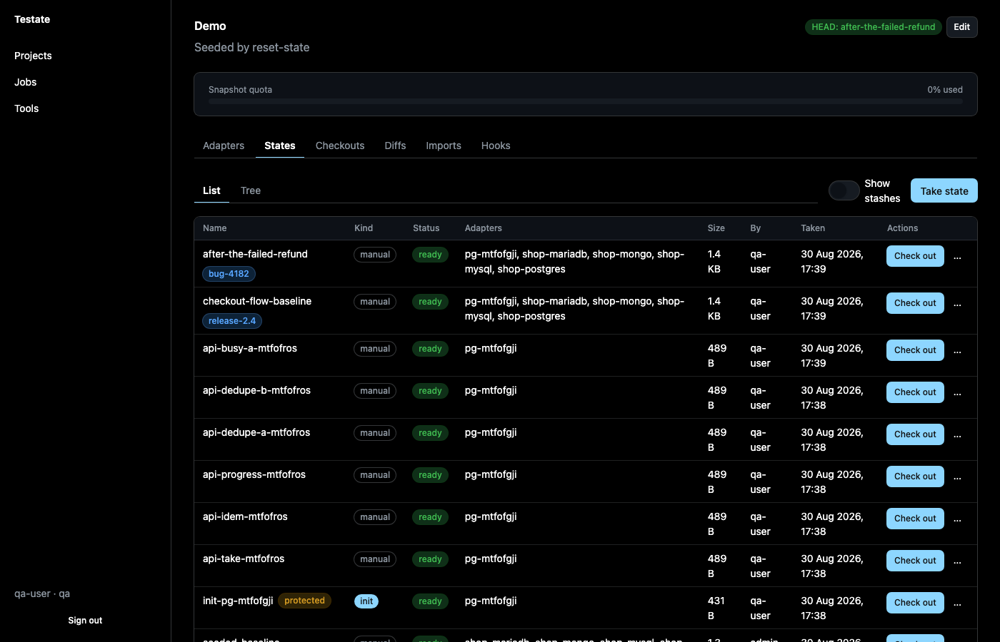
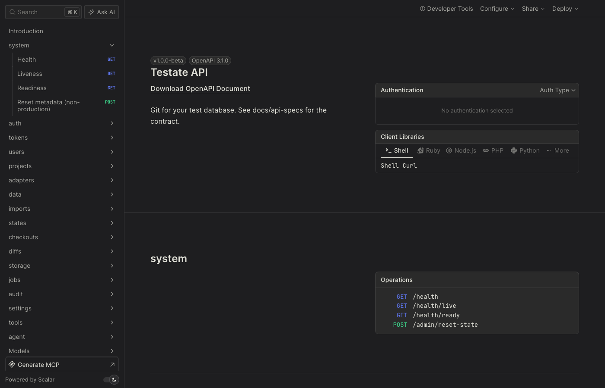
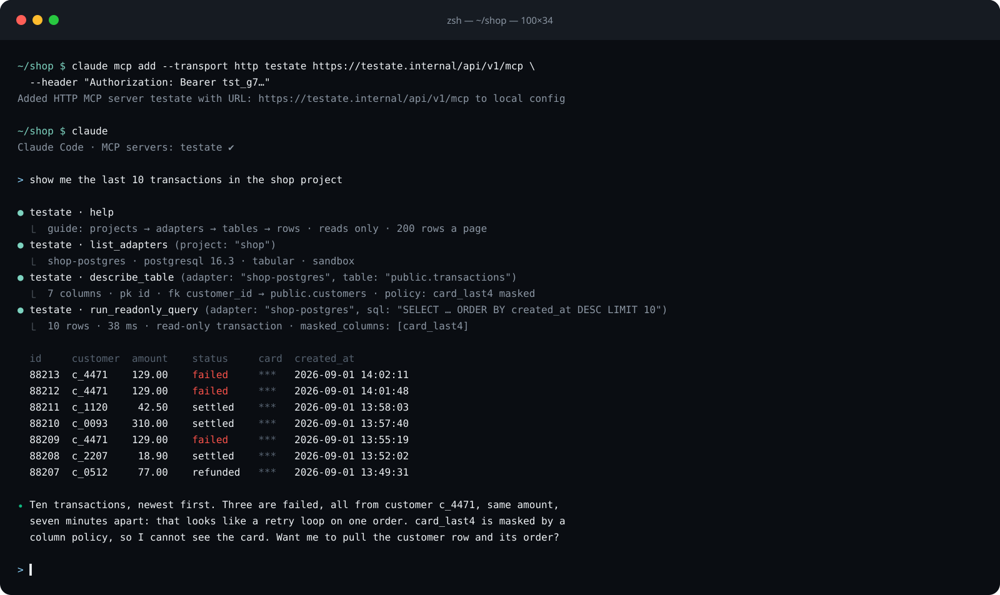
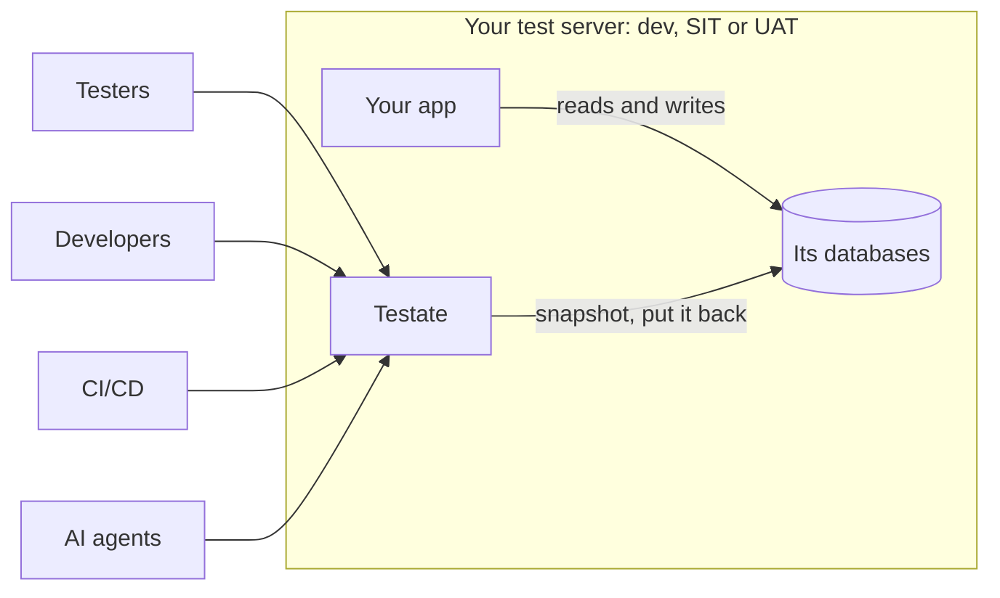

[](https://github.com/PT-Perkasa-Pilar-Utama/testate/actions/workflows/ci.yml)
[](https://scorecard.dev/viewer/?uri=github.com/PT-Perkasa-Pilar-Utama/testate)
[](https://github.com/PT-Perkasa-Pilar-Utama/testate/actions/workflows/codeql.yml)
[](https://github.com/PT-Perkasa-Pilar-Utama/testate/releases)
[](LICENSE)

**Git for your test database.** Snapshot it, break it, put it back in seconds.

**Website:** [pt-perkasa-pilar-utama.github.io/testate](https://pt-perkasa-pilar-utama.github.io/testate/)

Testate runs beside the system under test, takes data-only snapshots of its databases, and puts any of them back on demand. One container, one volume, no account, no telemetry. Version 1.0.0.

## The problem

Every QA team knows this chat:

> "Could you wipe the transactions on UAT? I can't create another order."
> "Reset DEV to the seed again please, the master data is off."

So a developer stops, SSHes in, and resets a database by hand. Or writes a reset endpoint that must never ship, and sometimes ships. Meanwhile QA does not automate, because every automated run needs a clean database first. And nobody lets an AI agent near a shared database to debug anything, because one hallucinated `DELETE` is one too many.

## What Testate does



- **Take a state.** A data-only snapshot of every database in a project, at one moment, with a name and tags.
- **Break it.** Run the suite, click through the app, edit rows in the grid, load a fixture.
- **Check it out.** One click or one API call puts every database back and reports per database. A stash is taken first, so even that is reversible.
- **See what moved.** Diff two states, or a state against the live database, down to the changed cell.

Nothing gets added to your application. Testate is a separate service that talks to the databases directly.

## Quick start

```sh
docker run -d --name testate -p 7378:7378 -v testate-data:/data \
  -e TESTATE_SECRETS_ACTIVE_KEY="$(openssl rand -base64 32)" \
  -e TESTATE_ADMIN_PASSWORD=change-me-now-1234 \
  ghcr.io/pt-perkasa-pilar-utama/testate:1.0.0
```

Open <http://localhost:7378>, sign in as `admin` with that password, and change it when asked.

Then: add a database under **Databases**, take a state under **States**, break something, click **Check out**. Where to point the host is the one thing that catches people, so read [Connecting a database](docs/CONNECTING.md) before you add the first one.

For anything you rely on, use Compose and an `.env` file: [Deployment plan](docs/DEPLOYMENT_PLAN.md). No Docker? There is [one binary per platform](#one-binary-no-docker).

## A look around

**States.** A project opens here: every state, newest first, HEAD marked, Check out on each one.



**The API, documented by the instance itself.** Everything the dashboard does is a REST call, and the running instance serves its own reference at `/api/v1/docs`.



**An agent, looking.** Register the MCP endpoint with an agent token and Claude reads the guide, finds the database, and answers in rows. Masked columns stay masked.



## Where it sits



Testate is one container on the same server, or the same network, as the databases. Nothing installs inside your app. Remove the container and nothing remains but the volume.

| The database runs                       | Point the adapter at                             | Details                                                                                           |
| --------------------------------------- | ------------------------------------------------ | ------------------------------------------------------------------------------------------------- |
| In Docker, same machine                 | the container's name, on a shared Docker network | [Connecting, A](docs/CONNECTING.md#a-a-database-running-in-docker-on-the-same-machine-as-testate) |
| Natively on the host                    | `host.docker.internal`                           | [Connecting, B](docs/CONNECTING.md#b-a-database-running-as-a-native-binary-on-the-host)           |
| In the cloud, managed or remote         | its address, with a route from the host          | [Connecting, C](docs/CONNECTING.md#c-a-database-in-the-cloud-managed-or-remote)                   |
| As an object store that is not Amazon's | its endpoint, in the Endpoint field              | [Connecting, D](docs/CONNECTING.md#d-an-object-store-that-is-not-amazons)                         |

## Who it is for

- **QA.** The main user. Test freely, reset in seconds, ask nobody.
- **Developers.** Reproduce a bug from the exact state QA saw it in. Let an agent inspect the data without a VPN and without fear.
- **Infra.** One image, one volume, one reverse proxy line. No reset scripts to babysit.

## What it works with

| Tier     | Engines                                       | What you get                                           |
| -------- | --------------------------------------------- | ------------------------------------------------------ |
| Tabular  | PostgreSQL, MySQL, MariaDB                    | view, snapshot, checkout, diff, extract, edit, import  |
| Document | MongoDB                                       | view, snapshot, checkout, diff, extract                |
| Files    | Object storage (any S3-compatible), SFTP, FTP | view, preview, download, insert, rename, delete, batch |

Every engine here is real, driven over its own protocol, and proven in a contract suite against a real server. S3-compatible means Amazon, Cloudflare R2, Google Cloud Storage, Backblaze B2, MinIO and anything else that speaks the protocol; the [connecting guide](docs/CONNECTING.md#d-an-object-store-that-is-not-amazons) has the endpoint for each.

Also in the box: a data grid with filters, keyset paging and write mode; a read-only SQL console with saved queries; CSV and XLSX import with a dry run; fixture extraction as SQL or JSON; three roles (Administrator, Tester, Guest); an audit log of every write.

## Reset from a pipeline

Every screen sits on the REST API, so a pipeline resets a database with one call before a run:

```sh
curl -sf -X POST "$TESTATE_URL/api/v1/projects/shop/checkouts?wait=120" \
  -H "Authorization: Bearer $TESTATE_TOKEN" -H "Content-Type: application/json" \
  -d '{"state_name": "seeded-baseline"}' | jq -r '.data.job.status'
```

Gate the step on the job's `status`, not the HTTP code. The full pattern, tokens, idempotency and the reference are in [CI/CD](docs/CI_CD.md).

## Let an agent look

Testate speaks MCP. An admin creates a token of kind **agent**, scoped to a project, with a role: **Guest** reads, **Tester** may also write to a sandbox, take a state and put one back. The token reaches `/api/v1/mcp` and nothing else.

```sh
claude mcp add --transport http testate https://testate.example.internal/api/v1/mcp \
  --header "Authorization: Bearer tst_YOUR_TOKEN"
```

The first tool the agent sees is `help`. Reads run in a read-only transaction, results are capped, column policies mask values before the agent sees them, and every call is audited. Everything else, including what happens when a token expires: [Agent access](docs/AGENT_ACCESS.md).

## Know the limits

Testate is honest about what it is. Read these before you install it.

| Limit                             | What it means                                                                                                                             | What to do                                                                                                                   |
| --------------------------------- | ----------------------------------------------------------------------------------------------------------------------------------------- | ---------------------------------------------------------------------------------------------------------------------------- |
| Databases go one at a time        | One project, several databases: each is snapshotted and restored on its own. Each is correct alone; the set is not guaranteed to line up. | Keep the app idle while you snapshot or reset.                                                                               |
| It only resets what you add       | An untracked database survives a reset, and Testate cannot warn you about a database it has never heard of.                               | Put every database the app writes to in one project.                                                                         |
| One project, one tester at a time | Two testers on one database share every reset. Two projects on one database are worse.                                                    | The connection test warns when another project already tracks that database.                                                 |
| Tabular first                     | PostgreSQL, MySQL and MariaDB get everything. MongoDB gets snapshots and diffs, not edits or imports. Files get a browser.                | Keep the transactional database in the tabular tier.                                                                         |
| It needs a real connection        | Firebase, Firestore, DynamoDB and Cosmos hand you an SDK, not a connection.                                                               | Supabase, Neon, RDS and Cloud SQL all work. On Supabase, use the direct connection, not the pooler.                          |
| Databases only                    | Caches, queues and whatever a service holds in memory stay as they were.                                                                  | Restart the service, or clear its cache, after a reset.                                                                      |
| Microservices are out of scope    | Every limit above compounds across services, and nothing orders the resets.                                                               | Stay inside one service. Add the others as read-only adapters, which can be browsed, snapshotted and diffed but never reset. |

## One binary, no Docker

Every release carries a standalone executable for macOS on Apple silicon, Linux on x86-64 and Windows on x86-64, with the dashboard and the migrations inside it. Download from the [releases page](https://github.com/PT-Perkasa-Pilar-Utama/testate/releases), then:

```sh
chmod +x testate-*-darwin-arm64          # macOS and Linux only
TESTATE_DATA_DIR=./testate-data \
TESTATE_SECRETS_ACTIVE_KEY="$(openssl rand -base64 32)" \
TESTATE_ADMIN_PASSWORD=change-me-now-1234 \
./testate-*-darwin-arm64
```

It listens on 7378 and keeps everything under `TESTATE_DATA_DIR`, which has to be set. Every other variable in `deploy/.env.example` applies the same way.

## Verify a download

Every release is built by this repository's own workflow and leaves a trail you can check without trusting us: SLSA build provenance and a keyless Sigstore signature on the image and on every binary, plus a CycloneDX SBOM.

```sh
gh attestation verify oci://ghcr.io/pt-perkasa-pilar-utama/testate:1.0.0 \
  --repo PT-Perkasa-Pilar-Utama/testate
cosign verify ghcr.io/pt-perkasa-pilar-utama/testate:1.0.0 \
  --certificate-identity-regexp 'https://github.com/PT-Perkasa-Pilar-Utama/testate/' \
  --certificate-oidc-issuer https://token.actions.githubusercontent.com
```

For a binary, run the same two commands on the archive, with `--bundle <archive>.sigstore.json` for cosign; the release also carries `testate-<version>.intoto.jsonl`, the provenance statement for every archive, for a check without network access (`gh attestation verify <archive> --bundle <that file>`). A download that fails either check is not ours; [SECURITY.md](SECURITY.md) says how to report it.

## Operate it

Upgrades, rolling back a failed migration, backups, and rotating the sealing key: [Deployment plan](docs/DEPLOYMENT_PLAN.md) and [Key rotation](docs/KEY_ROTATION.md). Health lives at `/api/v1/health/live` and `/api/v1/health/ready`, with no credential, for the probes.

## Run it from source

```sh
bun install
cp apps/api/.env.example apps/api/.env      # set the key and the admin password
bun run dev                                 # API on :7378, dashboard on :7379
```

`bun run reset:dev --yes --engines`, then `bun run seed:dev`, then `bun run dev`: a clean dev instance holding the demo project the test suite uses, on the databases from `deploy/compose.engines.yml`, with the admin on the password from `apps/api/.env`. [CLAUDE.md](CLAUDE.md) has the rest of the commands.

## Docs

[PRD](docs/PRD.md) · [Security standards](docs/SECURITY_STANDARDS.md) · [Technical specs](docs/technical-specs/_index.md) · [API specs](docs/api-specs/_index.md) · [Connecting a database](docs/CONNECTING.md) · [CI/CD](docs/CI_CD.md) · [Agent access](docs/AGENT_ACCESS.md) · [Deployment plan](docs/DEPLOYMENT_PLAN.md) · [Key rotation](docs/KEY_ROTATION.md) · [Security](SECURITY.md)

## License

MIT. Copyright PT. Perkasa Pilar Utama.
