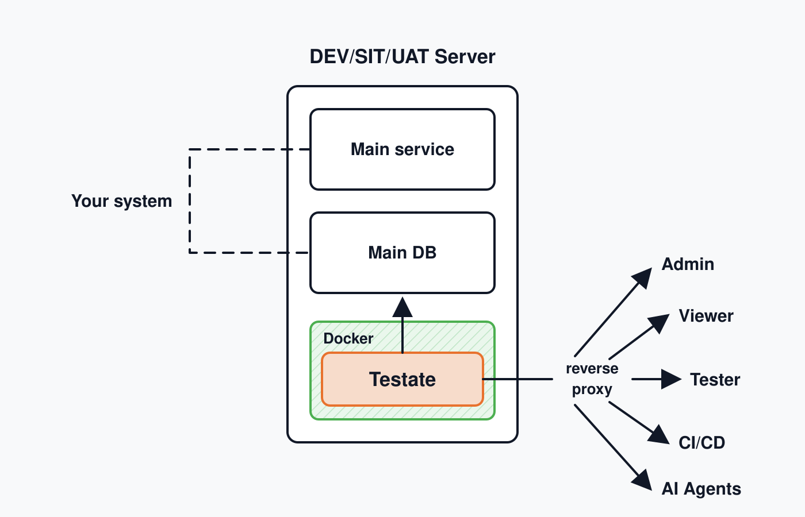

<p align="center">
  <picture>
    <source media="(prefers-color-scheme: dark)" srcset="docs/assets/logo-dark.svg">
    
  </picture>
</p>

**Git for your test database. Reset the database, not the developer.**



Testate is a self-hosted tool for QA teams. It takes data-only snapshots ("states") of the databases behind a system under test, restores them on demand, diffs them, imports fixtures, and lets an AI agent inspect them read-only. One Docker image, one volume, any sub-path.

| Tier     | Engines                    | What you get                                          |
| -------- | -------------------------- | ----------------------------------------------------- |
| Tabular  | PostgreSQL, MySQL, MariaDB | view, snapshot, checkout, diff, extract, edit, import |
| Document | MongoDB                    | view, snapshot, checkout, diff, extract               |
| Files    | S3, SFTP, FTP              | view, download                                        |
| REST     | any HTTP API               | saved requests, hooks around checkouts                |

## Status

Sprint 0. The API, the SPA, the deploy files, and the CI pipeline exist and pass the full gate. Every module answers with typed mock data behind the real HTTP contract; engine drivers land card by card. `docs/api-specs/_index.md` tracks each operation.

## Run it

```sh
cp deploy/.env.example deploy/.env
bun scripts/generate-key.ts        # paste into TESTATE_SECRETS_ACTIVE_KEY
# set TESTATE_ADMIN_PASSWORD
docker compose -f deploy/docker-compose.yml up -d
open http://localhost:3000
```

The image is `ghcr.io/pt-perkasa-pilar-utama/testate`, built from `deploy/Dockerfile` and slimmed with docker-slim by the manual **Deploy image** workflow (`.github/workflows/deploy-image.yml`): bump `version` in `package.json`, run the workflow, and it publishes `<version>` and `latest`. An already-published version is skipped.

Sign in as `admin`. The first login forces a password change. Create users under **Users**; roles are `viewer` < `qa` < `admin`.

Serve under a sub-path by setting `TESTATE_BASE_PATH=/testate`; `deploy/nginx.conf` shows the proxy block.

## Develop

Requires [Bun](https://bun.sh) 1.4.

```sh
bun install
docker compose -f deploy/compose.engines.yml up -d   # optional target engines
cp deploy/.env.example .env                          # TESTATE_ENV=development, TESTATE_DATA_DIR=./data
bun run dev                                          # API on :3000, Vite on :5173
```

The first boot needs `TESTATE_ADMIN_PASSWORD`; the first login forces a change. Outside production, `POST /api/v1/admin/reset-state` (admin, body `{"confirm":"reset"}`) wipes the metadata, recreates the admin from the environment, and ends every session, yours included.

| Command                  | Does                                                       |
| ------------------------ | ---------------------------------------------------------- |
| `bun run complete-check` | type-check, lint, format check, tests, build. The CI gate. |
| `bun test`               | unit and contract tests                                    |
| `bun run smoke`          | health checks against a running API (`SMOKE_BASE_URL`)     |
| `bun run generate-key`   | a new sealed-values key                                    |

Docs live in `docs/`: the [PRD](docs/PRD.md), the [technical specs](docs/technical-specs/_index.md), the [API specs](docs/api-specs/_index.md), the [coding standard](docs/CODING_STANDARD.md), [key rotation](docs/KEY_ROTATION.md), [agent access](docs/AGENT_ACCESS.md), and the [deployment plan](docs/DEPLOYMENT_PLAN.md).

## Layout

```text
apps/api        Bun + Hono API; one vertical module per resource (router, handler, service, mock, test)
apps/web        SolidJS 2 SPA; one feature per resource (model, presenter, view); Kumo components
packages/shared valibot schemas: the contract both apps derive their types from
deploy          Dockerfile, compose, nginx, engines for development
docs            PRD, specs, ADRs, standards
```

## License

MIT. Copyright PT. Perkasa Pilar Utama.
