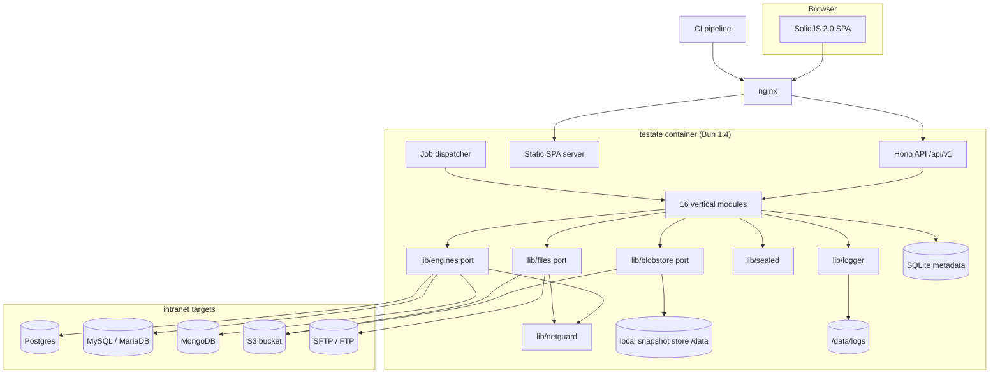
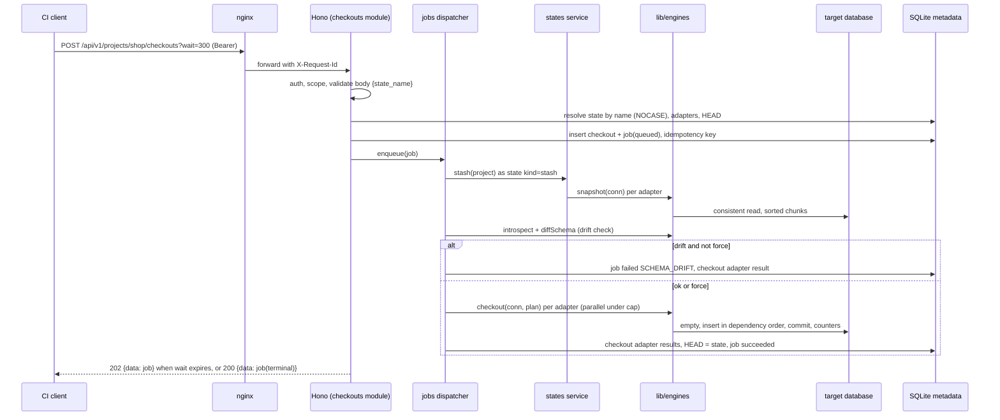
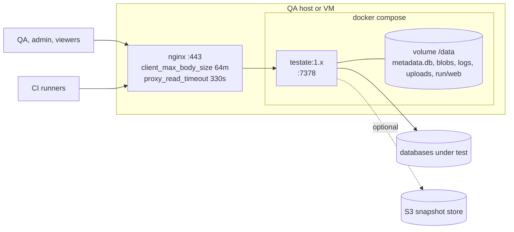

# 2. System Architecture

## 2.1 Style

Testate is a modular monolith in one process: a Hono API that also serves the built single-page app, a job dispatcher in the same process, a SQLite metadata store on the container volume, and a snapshot store on the volume or in S3. Sixteen vertical modules own the features; ten shared libraries hold the infrastructure every module needs.

### 2.1.1 Why this shape

| Option | Verdict | Reason |
| --- | --- | --- |
| Modular monolith, one process | Chosen | One image, one volume, one port. Jobs need the same engine drivers and sealed credentials the API needs; splitting them adds a queue and a second secret holder for no scaling need |
| API plus separate worker | Rejected | Two processes sharing SQLite on one volume is the one thing SQLite handles badly. The job load (a few concurrent restores) does not need a second host |
| Microservices per engine | Rejected | Every operation crosses the engine port anyway; a network hop per chunk is pure cost |
| Serverless or managed | Rejected | Long-running restores with pinned database connections do not fit function limits |

### 2.1.2 Component graph

## 2.2 Request lifecycle

Every request passes the same chain: wide-event middleware, authentication (cookie session or bearer token), CSRF check for cookie sessions, role and scope check, valibot validation, handler, service, repository or port, envelope. Long operations return a job.

## 2.3 Deployment graph

Production is one container and one volume. There is no cluster mode. Upgrades replace the image; the boot sequence copies the metadata database before migrations ([22-base-path-and-boot.md](22-base-path-and-boot.md)).

## 2.4 Module boundary map

| Module | Owns (tables) | Calls | Called by |
| --- | --- | --- | --- |
| `auth` | `sessions`, `api_tokens` | `users` (read), `audit` | every route (middleware) |
| `users` | `users` | `auth` (revoke sessions), `audit` | `auth` |
| `projects` | `projects` | `checkouts` (return to init), `states` (delete), `adapters`, `auth` (revoke scoped tokens), `jobs`, `audit` | `adapters`, `states`, `checkouts`, `diffs`, `imports` |
| `adapters` | `adapters`, `known_host_keys` | `lib/engines`, `lib/files`, `lib/netguard`, `lib/sealed`, `states` (init state), `checkouts` (return to init), `jobs`, `audit` | `data`, `imports`, `states`, `checkouts`, `diffs`, `storage`, `projects` |
| `data` | `saved_queries`, `query_history`, `write_sessions` | `adapters`, `lib/engines`, `states` (stash), `audit` | none |
| `imports` | `import_mappings`, `import_runs` | `adapters`, `lib/engines`, `lib/files`, `states` (stash), `jobs`, `audit` | none |
| `states` | `states`, `state_adapters`, `blobs`, `blob_pins` | `adapters`, `lib/engines`, `lib/blobstore`, `lib/snapshot`, `jobs`, `audit` | `checkouts`, `diffs`, `data`, `imports`, `projects`, `adapters` |
| `checkouts` | `checkouts`, `checkout_adapters` | `states`, `adapters`, `lib/engines`, `lib/blobstore`, `jobs`, `audit`, `projects` (HEAD) | `projects`, `adapters` |
| `diffs` | `diffs`, `diff_tables` | `states`, `adapters`, `lib/engines`, `lib/blobstore`, `lib/snapshot`, `jobs` | none |
| `storage` | none (host keys live in `adapters`) | `adapters`, `lib/files` | `imports` (source file) |
| `jobs` | `jobs`, `idempotency_keys` | none (job kinds are registered at the composition root) | every job-backed module |
| `audit` | `audit_logs` | none | every module |
| `settings` | `settings` | `lib/blobstore` (migration), `states` (retention), `diffs`, `data`, `jobs`, `audit` (retention) | `projects` (quota), `data` (limits), `jobs` (cap) |
| `ops` | none | `lib/db`, `lib/blobstore`, `jobs` (heartbeat), every module's seed | none |
| `tools` | none | `Bun.password`, WebCrypto | none |
| `agent` | none | `data`, `states`, `diffs`, `storage`, `adapters`, `audit` (read paths only) | none |

## 2.5 Rules for cross-module calls

- A module imports another module only through that module's `*.service.ts` exports and the schemas in `@testate/shared`. Repositories, handlers, and routers are private to their module.
- `lib/*` never imports a module. `lib/engines` calls `lib/netguard` and `lib/logger`; that is the only lib-to-lib dependency besides `lib/http` using `lib/logger`.
- Job kinds are registered at the composition root (`apps/api/src/index.ts`), so `jobs` depends on no module while every job-backed module depends on `jobs`.
- The `WideEvent` for a request or job is created by `lib/logger` and passed down. No module creates a second logger.

## 2.6 Data flow summary

| Flow | Path |
| --- | --- |
| Snapshot | `states` job → `lib/engines.snapshot` per adapter → sorted `RowChunk`s → `lib/snapshot` gzip and hash → `lib/blobstore.put` → manifest rows in `state_adapters` |
| Checkout | `checkouts` job → stash (snapshot flow) → `diffSchema` → `lib/engines.checkout` with `lib/blobstore.get` streams → counters → HEAD |
| Diff | `diffs` job → two manifests (or one plus a hidden `diff` snapshot) → `lib/snapshot.merge` per table → diff files in the blob store → `diff_tables` |
| Import | `imports` job → parser → mapping transforms → `validateImportRow` → `lib/engines.writeRows` batches → report and `/data/imports/<run>/rejected.csv` |
| Query | `data` request → `lib/engines.runQuery` on a reserved connection → capped rows → `query_history` |
| Storage browse | `storage` request → `lib/files.list/stat/read` → stream to client |
