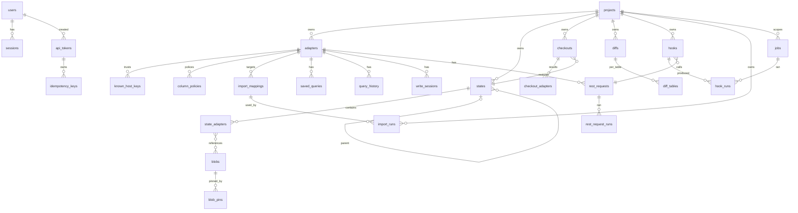

# 6. Data Model

The metadata store is one SQLite database, `${TESTATE_DATA_DIR}/metadata.db`, in WAL mode. Snapshot data never lives here; it lives in the blob store as content-addressed files, and this database holds the manifests that reference it.

## 6.1 Conventions

| Convention | Rule |
| --- | --- |
| Identifiers | `id TEXT PRIMARY KEY`, UUID version 7 from `Bun.randomUUIDv7()`, so ids sort by creation time |
| Timestamps | ISO-8601 UTC text with milliseconds (`2026-08-28T10:23:45.612Z`); `created_at` on every table, `updated_at` on every mutable table |
| Names | Tables `snake_case` plural; columns `snake_case`; enums as `TEXT` with a `CHECK` constraint |
| JSON | `TEXT` columns holding JSON, parsed with a valibot schema in the repository; never queried inside SQLite |
| Sealed columns | Suffix `_sealed`, `TEXT` holding the sealed envelope; listed in `lib/sealed/registry.ts` and [17-sealed-values.md](17-sealed-values.md) §17.4 |
| Foreign keys | `PRAGMA foreign_keys = ON`; `ON DELETE CASCADE` only where the parent's deletion is the child's deletion (states → state_adapters); audit rows have no foreign keys |
| Case-insensitive uniqueness | `COLLATE NOCASE` on `states.name` and `users.username` unique indexes |
| Booleans | `INTEGER` 0 or 1 |

## 6.2 Entity relationship diagram



## 6.3 Accounts

### USERS (UI label: "Users")

| column | type | nullable | default | key | notes |
| --- | --- | --- | --- | --- | --- |
| id | TEXT | no | | PK | UUID v7 |
| username | TEXT | no | | UNIQUE NOCASE | `[a-z0-9._-]{3,64}`; example `dina.qa` |
| display_name | TEXT | no | | | example `Dina Putri` |
| role | TEXT | no | | | `admin`, `qa`, `viewer` |
| password_hash | TEXT | no | | | argon2id |
| must_change_password | INTEGER | no | 1 | | forced change on next login |
| failed_login_count | INTEGER | no | 0 | | reset on success |
| locked_until | TEXT | yes | | | fifteen minutes after the fifth failure |
| disabled_at | TEXT | yes | | | disabled users cannot log in |
| last_login_at | TEXT | yes | | | |
| created_at, updated_at | TEXT | no | | | |

### SESSIONS

| column | type | nullable | default | key | notes |
| --- | --- | --- | --- | --- | --- |
| id | TEXT | no | | PK | |
| user_id | TEXT | no | | FK users | |
| token_hash | TEXT | no | | UNIQUE | SHA-256 of the cookie value |
| ip, user_agent | TEXT | yes | | | |
| last_seen_at | TEXT | no | | | idle timeout base |
| expires_at | TEXT | no | | | absolute, seven days |
| created_at | TEXT | no | | | |

### API_TOKENS (UI label: "API tokens")

| column | type | nullable | default | key | notes |
| --- | --- | --- | --- | --- | --- |
| id | TEXT | no | | PK | |
| name | TEXT | no | | | example `ci-shop` |
| role | TEXT | no | | | `admin`, `qa`, `viewer`; `agent` kind tokens are always `viewer` |
| kind | TEXT | no | `standard` | | `standard` (REST API) or `agent` (MCP only) |
| project_ids | TEXT | yes | | | JSON array of project ids; NULL = all projects |
| token_hash | TEXT | no | | UNIQUE | SHA-256 |
| prefix | TEXT | no | | | first eight characters after `tst_`, for display |
| created_by | TEXT | no | | FK users | |
| last_used_at, expires_at, revoked_at | TEXT | yes | | | |
| created_at | TEXT | no | | | |

## 6.4 Projects and adapters

### PROJECTS (UI label: "Projects")

| column | type | nullable | default | key | notes |
| --- | --- | --- | --- | --- | --- |
| id | TEXT | no | | PK | |
| slug | TEXT | no | | UNIQUE | `[a-z0-9-]{2,64}`; example `shop` |
| name, description | TEXT | name no, description yes | | | |
| quota_bytes | INTEGER | yes | | | NULL = setting default |
| head_state_id | TEXT | yes | | FK states | |
| head_status | TEXT | no | `none` | | `none`, `at_state`, `unknown` |
| head_changed_at | TEXT | yes | | | |
| created_by | TEXT | no | | FK users | |
| created_at, updated_at | TEXT | no | | | |

### ADAPTERS (UI label: "Adapters")

| column | type | nullable | default | key | notes |
| --- | --- | --- | --- | --- | --- |
| id | TEXT | no | | PK | immutable; states, mappings, and queries key on it |
| project_id | TEXT | no | | FK projects | |
| kind | TEXT | no | | | `database`, `storage`, `rest` |
| engine | TEXT | no | | | `postgres`, `mysql`, `mariadb`, `mongodb`, `s3`, `sftp`, `ftp`, `http` |
| name | TEXT | no | | UNIQUE (project_id, name) NOCASE | example `orders-db` |
| mode | TEXT | no | `sandbox` | | `sandbox`, `read_only`; storage and rest are always `read_only` |
| config_public | TEXT | no | | | JSON of non-secret fields: host, port, database, user, schemas, bucket, prefix, base_url, timeout |
| config_sealed | TEXT | no | | | sealed JSON of secret fields: password, connection string, access keys, private key, headers |
| readonly_config_sealed | TEXT | yes | | | optional read-only credential (database kind) |
| excluded_tables | TEXT | no | `[]` | | JSON array of `schema.table` |
| restore_mode | TEXT | no | `atomic` | | `atomic`, `fast` (MySQL and MariaDB only) |
| lock_timeout_ms | INTEGER | no | 60000 | | |
| target_hash | TEXT | yes | | | SHA-256 of host, port, database; change triggers a new init state |
| status | TEXT | no | `ok` | | `ok`, `error`, `disabled` |
| status_message | TEXT | yes | | | last probe error or deny-list reason |
| engine_version, dialect | TEXT | yes | | | from probe; dialect `mysql` or `mariadb` |
| capabilities | TEXT | yes | | | JSON `Capabilities` from probe |
| strategy | TEXT | yes | | | JSON `RestoreStrategy` selected from capabilities |
| read_only_enforcement | TEXT | yes | | | `transaction`, `credential`, `filter` |
| sealed_set_at, sealed_key_fingerprint | TEXT | yes | | | shown instead of the secret |
| last_probe_at | TEXT | yes | | | |
| created_at, updated_at | TEXT | no | | | |

### KNOWN_HOST_KEYS

| column | type | nullable | default | key | notes |
| --- | --- | --- | --- | --- | --- |
| id | TEXT | no | | PK | |
| adapter_id | TEXT | no | | FK adapters CASCADE | |
| key_type | TEXT | no | | | example `ssh-ed25519` |
| fingerprint | TEXT | no | | | SHA-256 base64 |
| accepted_by | TEXT | no | | FK users | |
| accepted_at | TEXT | no | | | |

## 6.5 States and blobs

### STATES (UI label: "States")

| column | type | nullable | default | key | notes |
| --- | --- | --- | --- | --- | --- |
| id | TEXT | no | | PK | |
| project_id | TEXT | no | | FK projects | |
| name | TEXT | no | | UNIQUE (project_id, name) NOCASE | may not match the UUID pattern; example `seeded-baseline` |
| kind | TEXT | no | | | `init`, `manual`, `stash`, `diff` |
| status | TEXT | no | `creating` | | `creating`, `ready`, `failed` |
| protected | INTEGER | no | 0 | | init always 1 |
| notes | TEXT | yes | | | |
| tags | TEXT | no | `[]` | | JSON array of strings |
| parent_state_id | TEXT | yes | | FK states | HEAD at snapshot time |
| stash_reason | TEXT | yes | | | `checkout`, `import`, `write-session`; kind stash only |
| owner_diff_id | TEXT | yes | | | kind diff only; deleted with the diff |
| job_id | TEXT | no | | FK jobs | |
| actor_user_id, actor_token_id | TEXT | yes | | | one of the two |
| size_bytes | INTEGER | no | 0 | | sum of unique blob bytes in this state |
| created_at, updated_at | TEXT | no | | | |

### STATE_ADAPTERS

| column | type | nullable | default | key | notes |
| --- | --- | --- | --- | --- | --- |
| state_id | TEXT | no | | PK part, FK states CASCADE | |
| adapter_id | TEXT | no | | PK part | no FK: survives adapter deletion |
| adapter_name | TEXT | no | | | name at snapshot time |
| engine, engine_version | TEXT | no | | | |
| fingerprint | TEXT | no | | | schema fingerprint |
| consistency | TEXT | no | | | `snapshot`, `best_effort` |
| removed | INTEGER | no | 0 | | set when the adapter is deleted |
| tables | TEXT | no | | | JSON array: `{ schema, name, rows, bytes, blob_hash, sort: "primary-key" \| "row-hash", warnings[] }` |
| introspection | TEXT | no | | | JSON `Introspection` used for drift and force |
| row_count, byte_count | INTEGER | no | | | |
| warnings | TEXT | no | `[]` | | JSON `EngineWarning[]` |

### BLOBS

| column | type | nullable | default | key | notes |
| --- | --- | --- | --- | --- | --- |
| hash | TEXT | no | | PK | SHA-256 hex of the gzip bytes |
| size_bytes | INTEGER | no | | | |
| ref_count | INTEGER | no | 0 | | manifests and diff tables referencing it |
| created_at | TEXT | no | | | |

### BLOB_PINS

| column | type | nullable | default | key | notes |
| --- | --- | --- | --- | --- | --- |
| blob_hash | TEXT | no | | PK part, FK blobs | |
| job_id | TEXT | no | | PK part, FK jobs | released when the job ends |

## 6.6 Checkouts, diffs, jobs

### CHECKOUTS (UI label: "Checkout history")

| column | type | nullable | default | key | notes |
| --- | --- | --- | --- | --- | --- |
| id | TEXT | no | | PK | |
| project_id, state_id, job_id | TEXT | no | | FK | |
| stash_state_id | TEXT | yes | | FK states | NULL for return-to-init |
| force | INTEGER | no | 0 | | |
| purpose | TEXT | no | `checkout` | | `checkout`, `return_to_init` |
| status | TEXT | no | `running` | | `running`, `succeeded`, `partial`, `failed`, `cancelled`, `interrupted` |
| actor_user_id, actor_token_id | TEXT | yes | | | |
| created_at, finished_at | TEXT | created no | | | |

### CHECKOUT_ADAPTERS

| column | type | nullable | default | key | notes |
| --- | --- | --- | --- | --- | --- |
| checkout_id, adapter_id | TEXT | no | | PK | |
| result | TEXT | no | `pending` | | `pending`, `restored`, `skipped`, `rolled_back`, `unknown`, `counters_failed` |
| strategy | TEXT | yes | | | JSON |
| rows, duration_ms, lock_wait_ms | INTEGER | yes | | | |
| skipped_tables, skipped_columns, defaulted_columns | TEXT | no | `[]` | | JSON; force mode |
| error | TEXT | yes | | | JSON `{ code, message, details }` |

### DIFFS

| column | type | nullable | default | key | notes |
| --- | --- | --- | --- | --- | --- |
| id | TEXT | no | | PK | |
| project_id, base_state_id, job_id | TEXT | no | | FK | |
| target_state_id | TEXT | yes | | FK states | NULL = live; then `live_state_id` holds the hidden diff state |
| live_state_id | TEXT | yes | | FK states | kind diff |
| status | TEXT | no | `running` | | `running`, `ready`, `failed` |
| summary | TEXT | yes | | | JSON per adapter per table counts |
| expires_at | TEXT | no | | | retention |
| created_at | TEXT | no | | | |

### DIFF_TABLES

| column | type | nullable | default | key | notes |
| --- | --- | --- | --- | --- | --- |
| diff_id, adapter_id, schema, table | TEXT | no | | PK | |
| added, removed, changed | INTEGER | no | 0 | | |
| compare | TEXT | no | | | `primary-key`, `row-hash` |
| blob_hash | TEXT | yes | | FK blobs | diff rows file; NULL when no difference |

### JOBS (UI label: "Jobs")

| column | type | nullable | default | key | notes |
| --- | --- | --- | --- | --- | --- |
| id | TEXT | no | | PK | |
| project_id, adapter_id | TEXT | yes | | | adapter set for single-adapter jobs; JSON `adapter_ids` in payload for multi |
| kind | TEXT | no | | | `snapshot`, `checkout`, `import`, `diff`, `state_delete`, `adapter_delete`, `project_delete`, `archive_import`, `storage_migration`, `backup` |
| status | TEXT | no | `queued` | | `queued`, `running`, `succeeded`, `failed`, `cancelled`, `partial`, `interrupted` |
| payload, result, error, progress | TEXT | payload no | | | JSON |
| cancel_requested | INTEGER | no | 0 | | |
| parent_request_id | TEXT | yes | | | wide-event correlation |
| actor_user_id, actor_token_id | TEXT | yes | | | |
| created_at, started_at, finished_at | TEXT | created no | | | |

`queue_position` is derived: the count of `queued` jobs created earlier, plus one.

### IDEMPOTENCY_KEYS

| column | type | nullable | default | key | notes |
| --- | --- | --- | --- | --- | --- |
| key_hash | TEXT | no | | PK part | SHA-256 of the header value |
| token_id | TEXT | no | | PK part | |
| job_id | TEXT | no | | FK jobs | |
| expires_at | TEXT | no | | | twenty-four hours |

## 6.7 Data, imports, REST, hooks

### IMPORT_MAPPINGS (UI label: "Mappings")

| column | type | nullable | default | key | notes |
| --- | --- | --- | --- | --- | --- |
| id | TEXT | no | | PK | |
| adapter_id | TEXT | no | | FK adapters CASCADE | |
| name | TEXT | no | | UNIQUE (adapter_id, name) NOCASE | |
| target | TEXT | no | | | `schema.table` or collection |
| columns | TEXT | no | | | JSON array `{ source, target, transforms: [...] }` |
| key_columns | TEXT | no | `[]` | | JSON; required for upsert |
| mode | TEXT | no | `append` | | `append`, `upsert`, `replace` |
| options | TEXT | no | `{}` | | JSON: delimiter, sheet, header_row, encoding |
| created_by | TEXT | no | | FK users | |
| created_at, updated_at | TEXT | no | | | |

### IMPORT_RUNS (UI label: "Imports")

| column | type | nullable | default | key | notes |
| --- | --- | --- | --- | --- | --- |
| id | TEXT | no | | PK | |
| project_id, adapter_id, mapping_id, job_id | TEXT | no | | FK | |
| source_kind, source_ref | TEXT | no | | | `upload` + file name, or `storage` + adapter id and path |
| dry_run | INTEGER | no | 0 | | |
| mode | TEXT | no | | | |
| stash_state_id | TEXT | yes | | FK states | |
| counts | TEXT | yes | | | JSON `{ inserted, updated, skipped, failed, duration_ms }` |
| rejected_path | TEXT | yes | | | `imports/<run>/rejected.csv` under the data dir |
| actor_user_id, actor_token_id | TEXT | yes | | | |
| created_at, finished_at | TEXT | created no | | | |

### COLUMN_POLICIES (UI label: "Column policies")

| column | type | nullable | default | key | notes |
| --- | --- | --- | --- | --- | --- |
| id | TEXT | no | | PK | |
| adapter_id | TEXT | no | | FK adapters CASCADE | |
| table_name | TEXT | no | | UNIQUE (adapter_id, table_name, column_name) | `schema.table` |
| column_name | TEXT | no | | | |
| required_function | TEXT | yes | | | JSON `{ name, params }`, example `{ "name": "hash_bcrypt", "params": { "cost": 12 } }` |
| mask | TEXT | yes | | | `redact`, `partial`, `hash` |
| display | INTEGER | no | 0 | | use as the lookup display column for the table |
| locked | INTEGER | no | 0 | | admin lock; `qa` cannot remove |
| created_by | TEXT | no | | FK users | |
| created_at, updated_at | TEXT | no | | | |

### SAVED_QUERIES, QUERY_HISTORY, WRITE_SESSIONS

| table | columns |
| --- | --- |
| saved_queries | id, adapter_id FK CASCADE, name UNIQUE (adapter_id, name) NOCASE, body JSON (`{ dialect: "sql", text }` or `{ dialect: "mongo", op, ... }`), created_by, created_at, updated_at |
| query_history | id, adapter_id, user_id, query_hash, query_text, mode, duration_ms, row_count, error, created_at; retention setting |
| write_sessions | id, adapter_id, user_id, started_at, last_write_at, ended_at, stash_state_id, write_count, foreign_key_checks INTEGER default 1 |

### REST_REQUESTS, REST_REQUEST_RUNS

| table | columns |
| --- | --- |
| rest_requests | id, adapter_id FK CASCADE, name UNIQUE (adapter_id, name) NOCASE, method, path, query JSON, headers_sealed, body, expected_status, created_at, updated_at |
| rest_request_runs | id, request_id FK CASCADE, job_id, hook_run_id, status_code, duration_ms, response_headers JSON, response_body (capped), error, created_at; last fifty kept per request |

### HOOKS, HOOK_RUNS

| table | columns |
| --- | --- |
| hooks | id, project_id FK CASCADE, trigger (`before_checkout`, `after_checkout`, `after_snapshot`, `after_import`), rest_request_id FK, position INTEGER, enabled INTEGER, fail_policy (`abort`, `continue`), created_at, updated_at |
| hook_runs | id, hook_id, job_id, request_run_id, status (`succeeded`, `failed`, `skipped`), started_at, finished_at |

## 6.8 Audit and settings

### AUDIT_LOGS (UI label: "Audit log")

| column | type | nullable | default | key | notes |
| --- | --- | --- | --- | --- | --- |
| id | TEXT | no | | PK | |
| actor_user_id, actor_token_id | TEXT | yes | | | no FK |
| actor_label | TEXT | no | | | `dina.qa` or `token:ci-shop` |
| action | TEXT | no | | | dotted, example `adapter.mode_loosened`, `checkout.created`, `project.deleted` |
| target_type, target_id | TEXT | no | | | |
| project_id, project_slug, adapter_id, adapter_name | TEXT | yes | | | text copies survive deletion |
| details | TEXT | no | `{}` | | JSON; never a sealed value or row data |
| outcome | TEXT | yes | | | `succeeded`, `failed`, `partial` for target-database actions, updated when the job ends |
| ip, user_agent | TEXT | yes | | | |
| created_at | TEXT | no | | | |

### SETTINGS

| column | type | nullable | default | key | notes |
| --- | --- | --- | --- | --- | --- |
| key | TEXT | no | | PK | example `retention.stash_keep` |
| value | TEXT | no | | | JSON |
| updated_by | TEXT | yes | | | |
| updated_at | TEXT | no | | | |

Keys and defaults: `store.driver` (`local`), `store.s3` (JSON, keys sealed), `retention.stash_keep` (5), `retention.diff_days` (7), `retention.query_history_days` (90), `retention.job_history_days` (90), `retention.audit_days` (365), `retention.import_run_days` (30), `quota.default_bytes` (10 GiB), `quota.instance_ceiling_bytes` (NULL = free space), `limits.query_rows_default` (500), `limits.query_rows_max` (5000), `limits.query_bytes` (10 MiB), `limits.query_timeout_ms` (30000), `limits.query_timeout_max_ms` (300000), `limits.upload_mb` (from env), `limits.token_requests_per_minute` (600), `limits.write_session_idle_minutes` (30), `netguard.deny` (JSON list, default `["127.0.0.0/8", "::1/128"]`), `log.sample_rate_by_route` (JSON).

### SCHEMA_MIGRATIONS

| column | type | notes |
| --- | --- | --- |
| version | INTEGER PK | from the file name `0007_diff_tables.sql` |
| name | TEXT | |
| applied_at | TEXT | |

## 6.9 State machines

### Job

| From | To | Actor | Guard |
| --- | --- | --- | --- |
| (new) | `queued` | enqueue | no running job on the same adapter, else `JOB_IN_PROGRESS` |
| `queued` | `running` | dispatcher | a slot under the global cap |
| `queued` | `cancelled` | user cancel | |
| `running` | `succeeded` | runner | |
| `running` | `partial` | runner | some adapters or the counters step failed |
| `running` | `failed` | runner | |
| `running` | `cancelled` | runner | cancel flag observed or engine cancel took effect |
| `running` | `interrupted` | boot recovery | process died |

Terminal: `succeeded`, `partial`, `failed`, `cancelled`, `interrupted`.

### State

| From | To | Actor | Guard |
| --- | --- | --- | --- |
| (new) | `creating` | snapshot, stash, init, archive import, diff | name unique, quota not exceeded |
| `creating` | `ready` | job | every manifest committed |
| `creating` | `failed` | job | pins released, blobs unreferenced |
| `ready` | (deleted) | state_delete job | not protected, not init; or project delete |

### Project HEAD

| From | To | Actor | Guard |
| --- | --- | --- | --- |
| `none` | `at_state` | first snapshot or checkout | |
| `at_state` | `at_state` | snapshot, checkout succeeded | new HEAD id |
| `at_state` | `unknown` | checkout partial or failed, interrupted job, deletion restore failure | |
| `unknown` | `at_state` | checkout succeeded | |

### Checkout adapter result

`pending` → `restored` | `skipped` | `rolled_back` | `unknown` | `counters_failed`; `counters_failed` → `restored` after `repairCounters` succeeds; `rolled_back` or `unknown` → `restored` after a retry.

### Adapter status

`ok` ↔ `error` on probe and retest; `ok` or `error` → `disabled` when the deny list matches; `disabled` → `ok` after a retest that passes the list.

### User

`active` → `locked` after five failures (time-boxed); `active` → `disabled` by admin; `disabled` → `active` by admin; any → (deleted) by admin except the last admin.

## 6.10 Migrations and seeding

Migrations are numbered SQL files under `apps/api/src/db/migrations/`, applied at boot by `lib/db/migrate.ts` inside one transaction per file, recorded in `schema_migrations`. The runner resolves the folder relative to its own module and takes the database path from the environment. There is no Drizzle and no ORM; the ledger is the truth.

```ts
// apps/api/src/lib/db/migrate.ts
import { SQL } from "bun";
import { join } from "node:path";
import { config } from "../config";

export async function migrate(sql: SQL): Promise<{ applied: string[] }> {
  const dir = join(import.meta.dir, "..", "..", "db", "migrations");   // relative to this module, never absolute
  const files = [...new Bun.Glob("*.sql").scanSync(dir)].sort();
  await sql`CREATE TABLE IF NOT EXISTS schema_migrations (version INTEGER PRIMARY KEY, name TEXT NOT NULL, applied_at TEXT NOT NULL)`;
  const done = new Set((await sql`SELECT version FROM schema_migrations`).map((r) => r.version));
  const applied: string[] = [];
  for (const file of files) {
    const version = Number(file.slice(0, 4));
    if (done.has(version)) continue;
    const text = await Bun.file(join(dir, file)).text();
    await sql.begin(async (tx) => {
      await tx.unsafe(text);
      await tx`INSERT INTO schema_migrations (version, name, applied_at) VALUES (${version}, ${file}, ${new Date().toISOString()})`;
    });
    applied.push(file);
  }
  return { applied };
}

// boot: new SQL(`sqlite://${config.dataDir}/metadata.db`) after the pre-migration copy
```

The Dockerfile copies `db/migrations/` next to `dist/index.js`, so the relative resolution holds inside the image. Forbidden anywhere: an absolute migrations path, an inlined connection string, or a raw read of one `.sql` file outside the ledger.

Seeding: there is no production seed beyond the bootstrap admin, which `ops` creates at boot from `TESTATE_ADMIN_USER` and `TESTATE_ADMIN_PASSWORD` when the `users` table is empty. The `dev` and `qa` seeds live under `modules/ops/seeds/` as idempotent TypeScript scripts, selected by the reset-state endpoint (05 §5.17) and never mounted in production.
