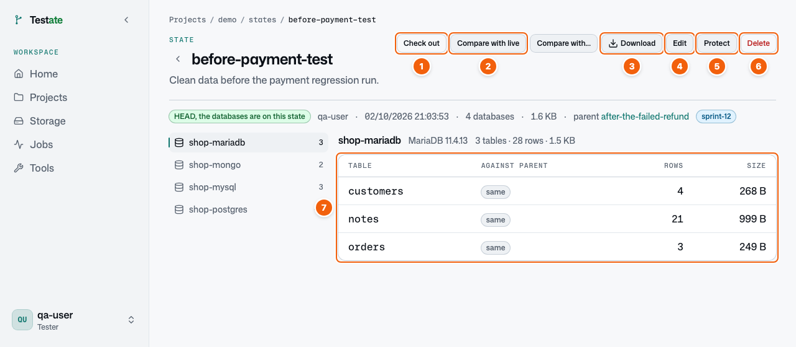

# Look after your states

Click the name of a state to open it.

| No. | What it is | What you do |
| --- | --- | --- |
| 1 | **Check out** | Put the data of this state back. |
| 2 | **Compare with live** | Find what changed since you saved this state. **Compare with…** compares it with another state. |
| 3 | **Download** | Save the state as one archive file, for example to keep a copy outside Testate. |
| 4 | **Edit** | Change the name, notes, or tags. |
| 5 | **Protect** | Stop all users from deleting this state. Click **Unprotect** to remove the protection. |
| 6 | **Delete** | Delete the state and free its space. You cannot delete a protected state. |
| 7 | Tables | The tables in each database, with the row count. **same** means no change from the parent state. |

Protect the states that your team uses again and again, for example a clean baseline.

**Check for changes** (in the **⋯** menu of the HEAD state) compares the HEAD state with the live data.

---

← Previous: [Your daily routine: save, test, reset](02-daily-routine.md) · [Contents](README.md) · Next: [Look at the data](04-look-at-data.md) →
