# Panduan Testate untuk Tester

Panduan ini untuk pengguna dengan peran **Tester**. Anda tidak perlu paham SQL atau database untuk memakai sebagian besar fiturnya. Semua gambar diambil dari aplikasi asli. Angka oranye pada gambar sama dengan angka pada tabel di bawahnya.

Tampilan Testate memakai bahasa Inggris. Panduan ini menulis nama tombol persis seperti di layar, dengan huruf tebal, agar mudah Anda cari. Contoh: klik **Snapshot** (simpan data).

English version: [tester-guide-en.md](tester-guide-en.md).

## Daftar isi

1. [Apa yang dilakukan Testate](#1-apa-yang-dilakukan-testate)
2. [Masuk ke Testate](#2-masuk-ke-testate)
3. [Rutinitas harian: simpan, uji, kembalikan](#3-rutinitas-harian-simpan-uji-kembalikan)
4. [Merawat state Anda](#4-merawat-state-anda)
5. [Melihat data](#5-melihat-data)
6. [Mengubah data](#6-mengubah-data)
7. [Membandingkan dua titik waktu](#7-membandingkan-dua-titik-waktu)
8. [File](#8-file)
9. [Jobs dan Tools](#9-jobs-dan-tools)
10. [Menyiapkan proyek baru](#10-menyiapkan-proyek-baru)
11. [Jika terjadi masalah](#11-jika-terjadi-masalah)
12. [Hal yang hanya dilakukan administrator](#12-hal-yang-hanya-dilakukan-administrator)

## 1. Apa yang dilakukan Testate

Setiap kali Anda menguji, data di database uji berubah. Sebelum pengujian berikutnya, data harus dikembalikan seperti semula. Testate melakukannya untuk Anda dengan satu klik.

```
  1. Snapshot            2. Uji                 3. Check out
  ┌──────────────┐       ┌──────────────┐       ┌──────────────┐
  │ Simpan data  │ ────▶ │ Jalankan tes │ ────▶ │ Kembalikan   │
  │ jadi "state" │       │ data berubah │       │ data simpanan│
  └──────────────┘       └──────────────┘       └──────────────┘
         ▲                                              │
         └──────────── ulangi sesering yang Anda perlu ─┘
```

### Istilah yang akan Anda temui

| Istilah | Artinya | Contoh |
| --- | --- | --- |
| **Project** (proyek) | Satu sistem yang diuji. Berisi database dan state. | "Payment service SIT" |
| **Database** (juga **adapter**) | Satu koneksi dari Testate ke database atau penyimpanan file yang asli. | `shop-postgres` |
| **State** | Salinan data semua database dalam proyek pada satu waktu. | `before-payment-test` |
| **Snapshot** | Tombol untuk menyimpan state baru. | |
| **Check out** | Mengembalikan data sebuah state ke database yang sedang dipakai (live). | |
| **HEAD** | State yang sama dengan data live saat ini. | `HEAD before-payment-test` |
| **Stash** | State yang disimpan Testate sendiri sebelum mengubah data. Dipakai untuk membatalkan perubahan. | `stash-2026-10-02T13-50-20…` |
| **Starting point** (`init`) | State pertama, disimpan saat database masuk ke proyek. Tidak bisa dihapus. | `init` |
| **Compare** (diff) | Daftar baris yang berbeda antara dua titik waktu. | 4 baris ditambah |
| **Sandbox** / **Read-only** | Sandbox boleh diubah. Read-only hanya boleh dilihat. | |

## 2. Masuk ke Testate

### 2.1 Masuk pertama kali

Administrator memberi Anda username dan password sementara.

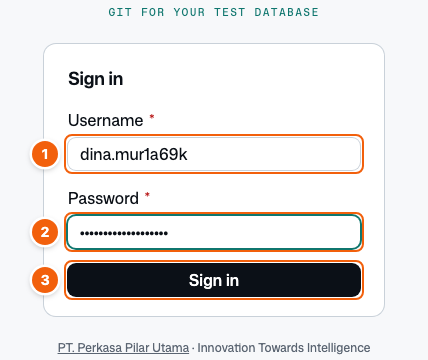

| No. | Apa ini | Yang Anda lakukan |
| --- | --- | --- |
| 1 | **Username** | Ketik username dari administrator. |
| 2 | **Password** | Ketik password sementara. |
| 3 | **Sign in** (masuk) | Klik. |

Saat pertama masuk, Testate meminta Anda membuat password sendiri.

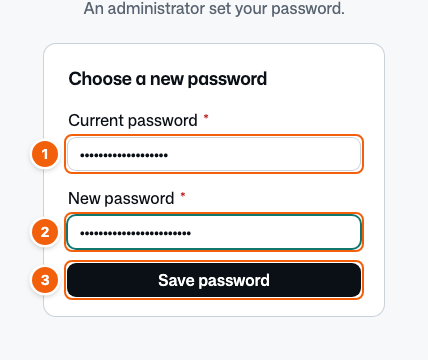

| No. | Apa ini | Yang Anda lakukan |
| --- | --- | --- |
| 1 | **Current password** (password sekarang) | Ketik lagi password sementara. |
| 2 | **New password** (password baru) | Ketik password baru, minimal 12 karakter. |
| 3 | **Save password** (simpan) | Klik. Testate membuka layar Home. |

> **Catatan:** Setelah lima kali salah password, akun Anda dikunci selama 15 menit. Tunggu, atau hubungi administrator.

### 2.2 Layar Home

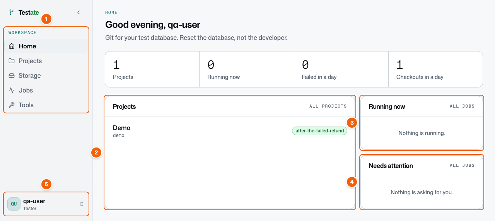

| No. | Apa ini | Yang Anda lakukan |
| --- | --- | --- |
| 1 | Menu samping | Pindah ke **Home**, **Projects**, **Storage**, **Jobs**, atau **Tools**. |
| 2 | **Projects** | Klik nama proyek untuk membukanya. Label hijau menunjukkan HEAD-nya. |
| 3 | **Running now** (sedang berjalan) | Pekerjaan yang sedang dikerjakan Testate, misalnya snapshot. |
| 4 | **Needs attention** (perlu perhatian) | Pekerjaan yang gagal. Buka dan baca pesan errornya. |
| 5 | Nama Anda | Klik untuk membuka menu akun. |

### 2.3 Menu akun

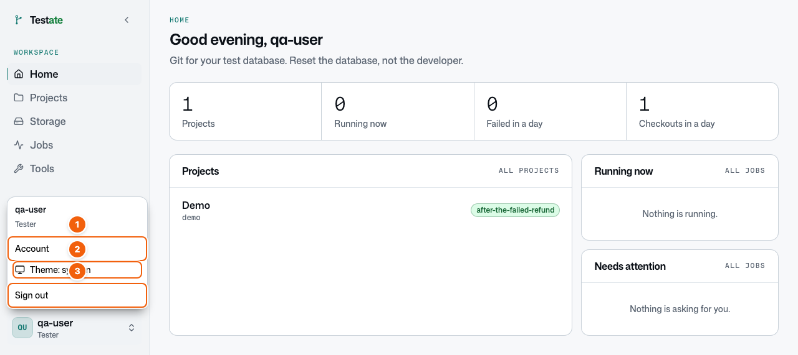

| No. | Apa ini | Yang Anda lakukan |
| --- | --- | --- |
| 1 | **Account** (akun) | Ganti password dan lihat sesi Anda. |
| 2 | **Theme** (tema) | Klik untuk berganti warna: ikut sistem, terang, atau gelap. |
| 3 | **Sign out** (keluar) | Klik setelah selesai. |

### 2.4 Mengganti password nanti

Buka **Account** dari menu akun.

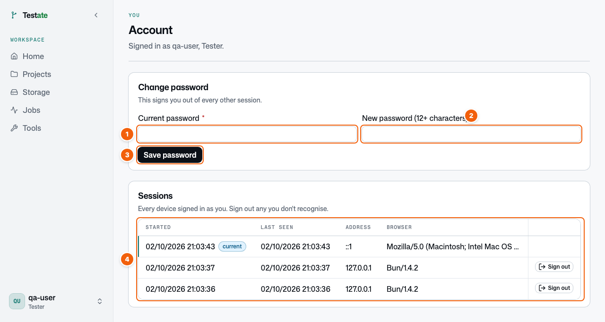

| No. | Apa ini | Yang Anda lakukan |
| --- | --- | --- |
| 1 | **Current password** | Ketik password Anda sekarang. |
| 2 | **New password** | Ketik password baru, minimal 12 karakter. |
| 3 | **Save password** | Klik. Testate mengeluarkan Anda dari semua perangkat lain. |
| 4 | **Sessions** (sesi) | Setiap perangkat yang sedang memakai akun Anda. Klik **Sign out** pada perangkat yang tidak Anda kenal. |

## 3. Rutinitas harian: simpan, uji, kembalikan

### 3.1 Membuka proyek

Klik **Projects** di menu samping.

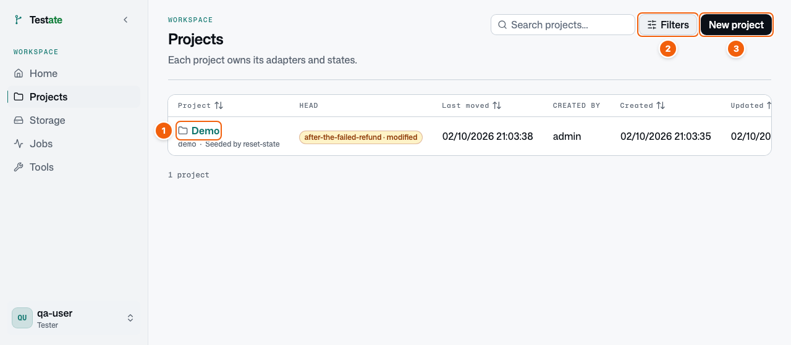

| No. | Apa ini | Yang Anda lakukan |
| --- | --- | --- |
| 1 | Nama proyek | Klik untuk membuka proyek. |
| 2 | **Filters** (saring) | Tampilkan sebagian proyek saja. |
| 3 | **New project** (proyek baru) | Buat proyek baru. Lihat [bagian 10](#10-menyiapkan-proyek-baru). |

### 3.2 Layar proyek

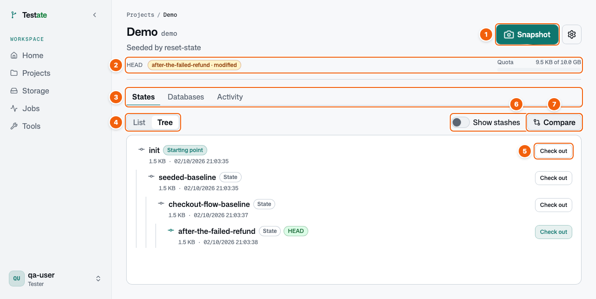

| No. | Apa ini | Yang Anda lakukan |
| --- | --- | --- |
| 1 | **Snapshot** | Simpan data saat ini sebagai state baru. |
| 2 | **HEAD** dan **Quota** | HEAD adalah state yang sama dengan data live. **modified** berarti data sudah berubah sejak itu. Quota adalah ruang yang dipakai state Anda. |
| 3 | Tab | **States** berisi daftar state. **Databases** berisi koneksi. **Activity** berisi riwayat. |
| 4 | **List** / **Tree** | Dua tampilan dari state yang sama. **Tree** (pohon) menunjukkan asal setiap state. |
| 5 | **Check out** | Kembalikan data state ini. |
| 6 | **Show stashes** | Tampilkan juga state yang disimpan Testate sendiri. |
| 7 | **Compare** (bandingkan) | Cari perubahan antara dua titik waktu. Lihat [bagian 7](#7-membandingkan-dua-titik-waktu). |

### 3.3 Langkah 1: simpan data (Snapshot)

Lakukan ini sebelum mulai menguji.

1. Klik **Snapshot**.
2. Isi formulirnya.
3. Klik **Take** (ambil).

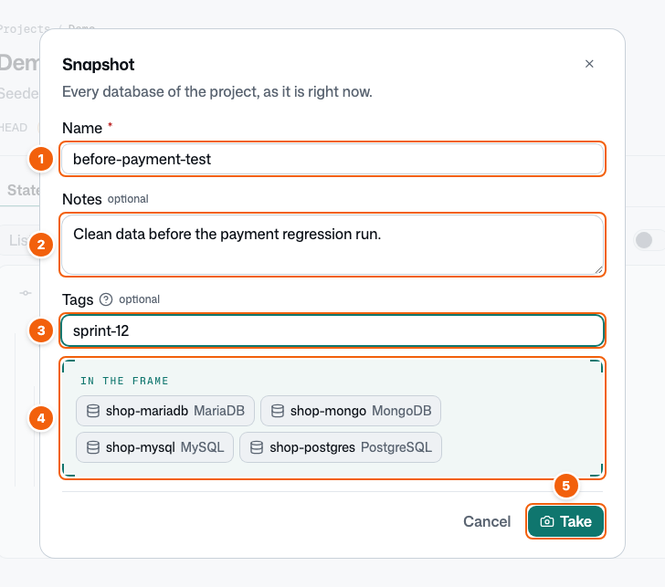

| No. | Apa ini | Yang Anda lakukan |
| --- | --- | --- |
| 1 | **Name** (nama) | Ketik nama pendek. Nama harus berbeda dalam satu proyek. Contoh: `before-payment-test`. |
| 2 | **Notes** (catatan) | Boleh dikosongkan. Tulis alasan Anda menyimpannya. |
| 3 | **Tags** (label) | Boleh dikosongkan. Label untuk mencari state nanti, misalnya nomor sprint atau nomor bug. |
| 4 | **In the frame** | Database yang ikut disimpan. Testate selalu menyimpan semuanya. |
| 5 | **Take** | Klik. Testate menyimpan state di latar belakang. |

Beberapa detik kemudian, state baru muncul di urutan teratas.

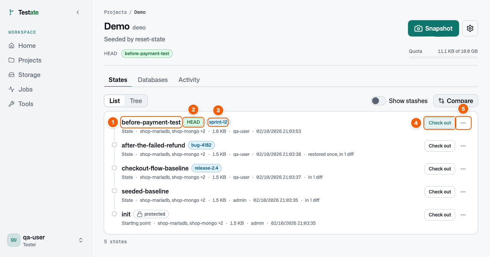

| No. | Apa ini | Yang Anda lakukan |
| --- | --- | --- |
| 1 | Nama state | Klik untuk melihat isinya. Lihat [bagian 4](#4-merawat-state-anda). |
| 2 | **HEAD** | Data live sekarang sama dengan state ini. |
| 3 | Tag | Label yang Anda ketik. |
| 4 | **Check out** | Kembalikan data state ini. |
| 5 | Menu **⋯** | Aksi lain: **Check for changes**, **Download**, **Edit**, **Protect**, **Delete**. |

### 3.4 Langkah 2: jalankan pengujian

Pakai aplikasi Anda seperti biasa. Testate tidak melakukan apa-apa di langkah ini.

Saat data berubah, label HEAD menampilkan **modified** (berubah). Contoh: `before-payment-test · modified`. Artinya data live sudah tidak sama dengan state tersebut.

### 3.5 Langkah 3: kembalikan data (Check out)

1. Buka tab **States**.
2. Cari state yang Anda mau.
3. Klik **Check out**.
4. Baca jendela yang muncul.
5. Klik **Check out** di jendela itu.

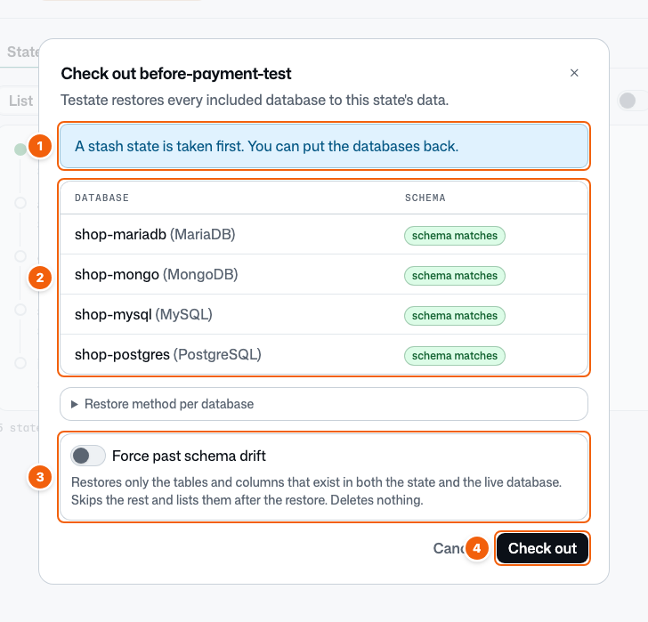

| No. | Apa ini | Yang Anda lakukan |
| --- | --- | --- |
| 1 | Pesan stash | Testate menyimpan data saat ini dulu sebagai stash. Anda bisa membatalkan checkout dengan stash itu. |
| 2 | Daftar database | Setiap database dan hasil cek skemanya. **schema matches** berarti susunan tabelnya sama. |
| 3 | **Force past schema drift** | Pakai hanya jika susunan tabel berubah. Baca [bagian 11](#11-jika-terjadi-masalah) dulu. |
| 4 | **Check out** | Klik untuk mulai. |

> **Perhatian:** Checkout mengganti data live di semua database proyek. Beri tahu rekan yang memakai database uji yang sama sebelum Anda mulai.

**Restore method per database** menunjukkan cara Testate menulis ke setiap database. Bagian ini memberi tahu apakah tabel akan dikunci selama proses. Bagian ini juga memberi tahu apakah pengguna lain bisa melihat data yang baru setengah dipulihkan, seperti pada MongoDB. Baca bagian ini sebelum checkout database yang dipakai orang lain.

### 3.6 Melihat hasil checkout

Buka tab **Activity**, lalu **Checkouts**.

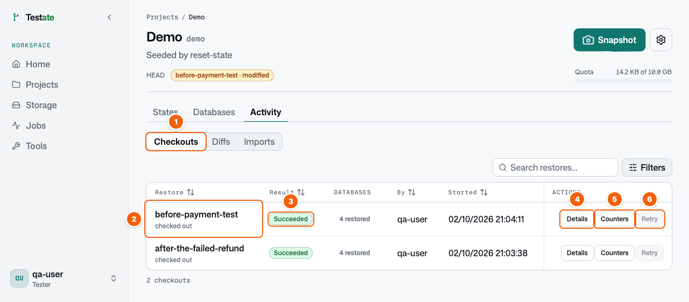

| No. | Apa ini | Yang Anda lakukan |
| --- | --- | --- |
| 1 | **Checkouts** | Daftar semua checkout di proyek ini. |
| 2 | State | State yang dikembalikan. |
| 3 | **Result** (hasil) | **Succeeded** berarti semua database berhasil dikembalikan. **Failed** berarti ada yang gagal. |
| 4 | **Details** (rincian) | Lihat hasil setiap database. |
| 5 | **Counters** (penghitung ID) | Testate mengatur ulang penghitung ID setelah checkout. Klik untuk melihat hasilnya. Jika langkah itu gagal, perbaiki dari sana. |
| 6 | **Retry** (ulangi) | Jalankan lagi checkout untuk database yang gagal. Tombol ini aktif hanya setelah ada kegagalan. |

### 3.7 Membatalkan checkout (stash)

Sebelum checkout, impor, atau perubahan pertama, Testate menyimpan stash. Untuk kembali:

1. Buka tab **States**.
2. Klik **Show stashes**.
3. Cari stash dengan waktu tepat sebelum perubahan Anda.
4. Klik **Check out** pada stash itu.

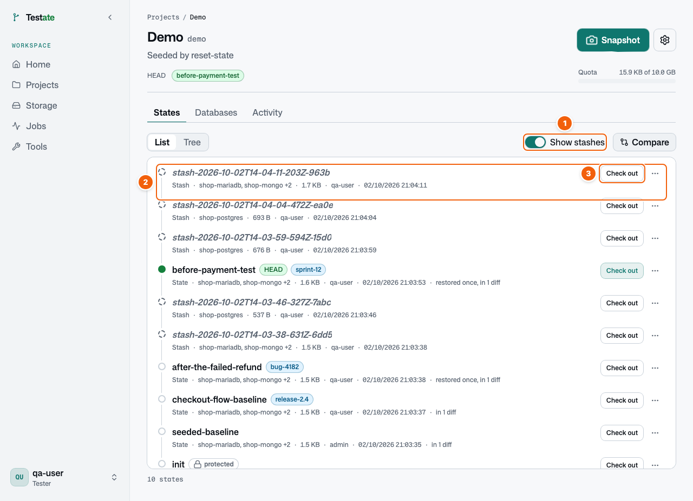

| No. | Apa ini | Yang Anda lakukan |
| --- | --- | --- |
| 1 | **Show stashes** | Nyalakan untuk menampilkan stash di daftar. |
| 2 | Stash | Namanya berisi tanggal dan jam. Di bawahnya tertulis database yang disimpan. |
| 3 | **Check out** | Kembalikan data stash itu. |

> **Catatan:** Testate hanya menyimpan stash terbaru. Stash lama terhapus otomatis. Untuk data yang Anda perlukan lama, simpan state biasa dengan **Snapshot**.

## 4. Merawat state Anda

Klik nama state untuk membukanya.


| No. | Apa ini | Yang Anda lakukan |
| --- | --- | --- |
| 1 | **Check out** | Kembalikan data state ini. |
| 2 | **Compare with live** | Cari perubahan sejak state ini disimpan. **Compare with…** membandingkannya dengan state lain. |
| 3 | **Download** (unduh) | Simpan state sebagai satu file arsip, misalnya sebagai cadangan di luar Testate. |
| 4 | **Edit** (ubah) | Ganti nama, catatan, atau tag. |
| 5 | **Protect** (lindungi) | Cegah semua pengguna menghapus state ini. Klik **Unprotect** untuk membuka perlindungan. |
| 6 | **Delete** (hapus) | Hapus state dan kosongkan ruangnya. State yang dilindungi tidak bisa dihapus. |
| 7 | Tabel | Tabel di setiap database beserta jumlah barisnya. **same** berarti tidak berubah dari state sebelumnya. |

Lindungi state yang sering dipakai tim, misalnya data dasar yang bersih.

**Check for changes** (di menu **⋯** state HEAD) membandingkan state HEAD dengan data live.

## 5. Melihat data

### 5.1 Database dalam proyek

Buka tab **Databases**.

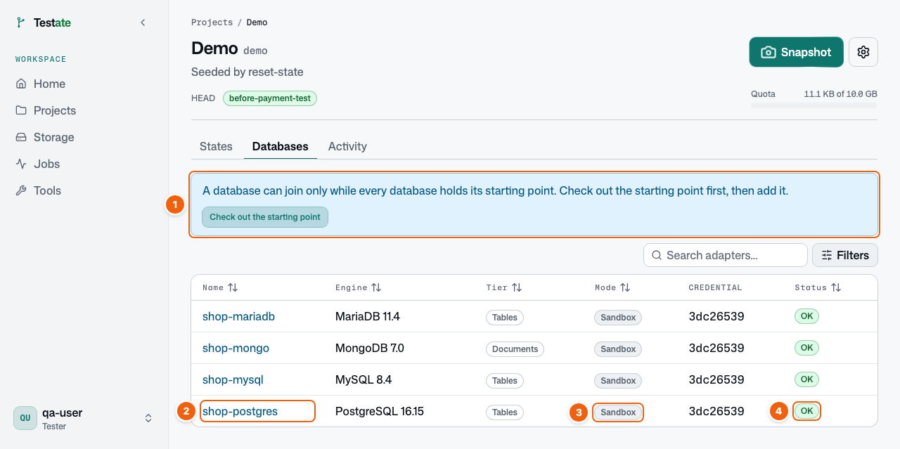

| No. | Apa ini | Yang Anda lakukan |
| --- | --- | --- |
| 1 | Pesan starting point | Database baru hanya bisa ditambahkan saat proyek berada di starting point. Klik **Check out the starting point** dulu. |
| 2 | Nama database | Klik untuk membukanya. |
| 3 | **Mode** | **Sandbox** boleh diubah. **Read-only** hanya boleh dilihat. |
| 4 | **Status** | **OK** berarti Testate bisa terhubung. |

### 5.2 Satu database

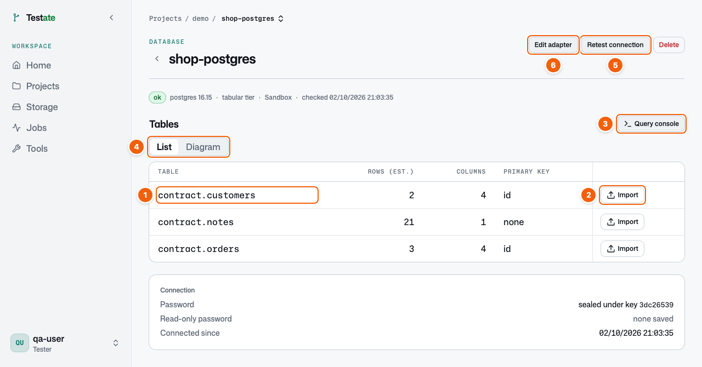

| No. | Apa ini | Yang Anda lakukan |
| --- | --- | --- |
| 1 | Nama tabel | Klik untuk melihat barisnya. |
| 2 | **Import** (impor) | Masukkan file CSV atau Excel ke tabel ini. Lihat [bagian 6.2](#62-impor-file-csv-atau-excel). |
| 3 | **Query console** | Tulis query untuk membaca data. |
| 4 | **List** / **Diagram** | **Diagram** menunjukkan hubungan antartabel. |
| 5 | **Retest connection** | Cek koneksi lagi, misalnya setelah password database diganti. |
| 6 | **Edit adapter** | Ganti nama, tabel yang dikecualikan, atau detail koneksi. Minta detail koneksi ke developer. |

**ROWS (EST.)** adalah perkiraan jumlah baris dari database. Buka tabelnya untuk melihat baris yang sebenarnya.

### 5.3 Menjelajah tabel

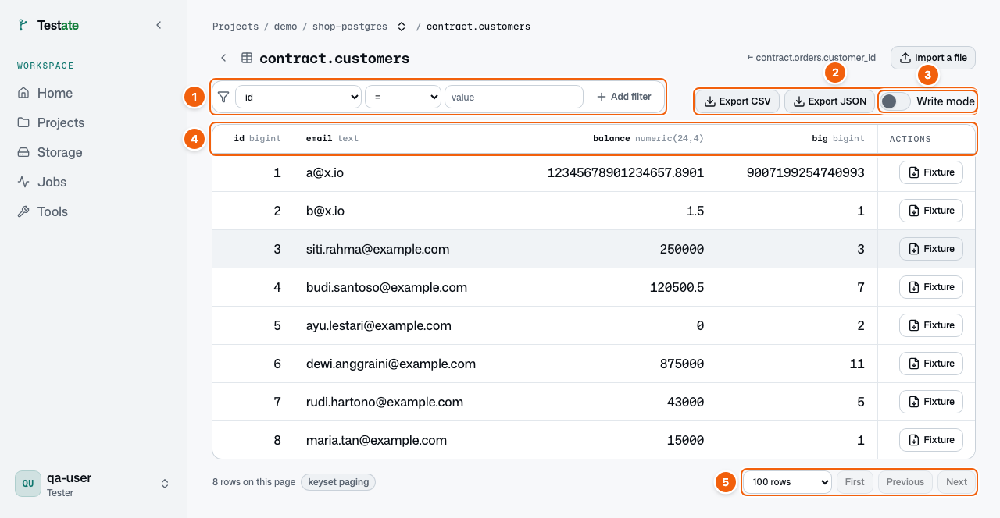

| No. | Apa ini | Yang Anda lakukan |
| --- | --- | --- |
| 1 | Filter | Pilih kolom dan kondisi, ketik nilai, lalu klik **Add filter**. Anda bisa menambah lebih dari satu filter. |
| 2 | **Export CSV** / **Export JSON** | Unduh baris sebagai file. |
| 3 | **Write mode** (mode ubah) | Nyalakan untuk mengubah baris. Lihat [bagian 6.1](#61-mengubah-baris-secara-manual). |
| 4 | Nama kolom | Klik nama kolom untuk mengurutkan. |
| 5 | Halaman | Pilih jumlah baris per halaman. Klik **Next** dan **Previous** untuk pindah halaman. |

Tombol **Fixture** pada sebuah baris membuat data uji dari baris itu. Hasilnya ikut memuat baris lain yang ditautkan, dalam bentuk SQL atau JSON.

### 5.4 Query console

Pakai jika Anda sedikit paham SQL. Konsol ini hanya membaca. Konsol ini tidak pernah mengubah data, apa pun yang Anda ketik.

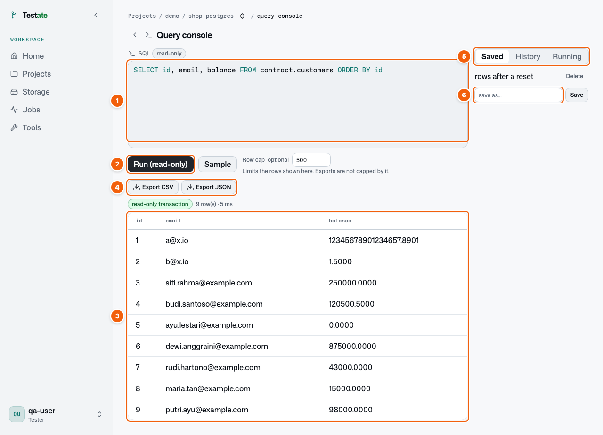

| No. | Apa ini | Yang Anda lakukan |
| --- | --- | --- |
| 1 | Editor SQL | Ketik query. Editor menyarankan nama tabel dan kolom. |
| 2 | **Run (read-only)** | Jalankan query. **Sample** menuliskan contoh query untuk Anda. |
| 3 | Hasil | Baris yang ditemukan query. **Row cap** membatasi jumlah baris yang tampil. |
| 4 | **Export CSV** / **Export JSON** | Unduh semua baris hasil query. |
| 5 | **Saved** / **History** / **Running** | Query tersimpan, query yang pernah dijalankan, dan query yang sedang berjalan. |
| 6 | Kotak "save as..." | Ketik nama lalu klik **Save** untuk menyimpan query. Klik query tersimpan untuk menjalankannya lagi. |

### 5.5 Dokumen MongoDB

Database MongoDB berisi collection dan dokumen, bukan tabel dan baris.

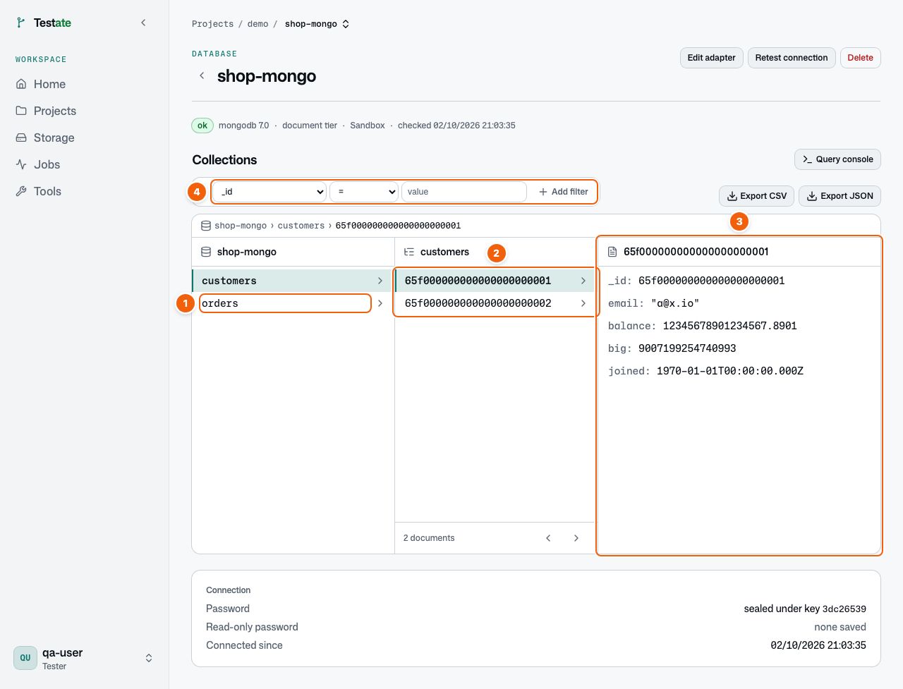

| No. | Apa ini | Yang Anda lakukan |
| --- | --- | --- |
| 1 | Collection | Klik untuk melihat dokumennya. |
| 2 | Dokumen | Klik dokumen untuk melihat field-nya. |
| 3 | Field | Isi dokumen. Klik field yang berisi field lain untuk membukanya. |
| 4 | Filter | Tampilkan hanya dokumen yang cocok. |

## 6. Mengubah data

Anda hanya bisa mengubah data di database **Sandbox**. Testate menyimpan stash lebih dulu, jadi perubahan selalu bisa dibatalkan.

### 6.1 Mengubah baris secara manual

1. Buka sebuah tabel.
2. Nyalakan **Write mode**.

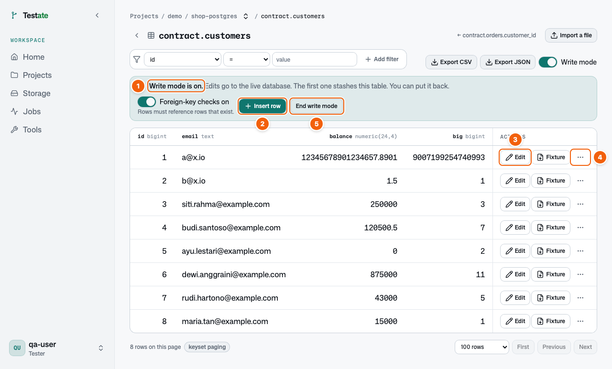

| No. | Apa ini | Yang Anda lakukan |
| --- | --- | --- |
| 1 | Pesan write mode | Perubahan Anda langsung masuk ke database live. Testate menyimpan stash tabel sebelum perubahan pertama. |
| 2 | **Insert row** | Tambah baris baru. |
| 3 | **Edit** | Ubah baris ini. |
| 4 | Menu **⋯** | Berisi **Delete row** (hapus baris). Testate langsung menghapusnya tanpa bertanya. |
| 5 | **End write mode** | Klik setelah selesai. |

**Foreign-key checks on** memastikan setiap baris hanya menunjuk ke baris yang ada. Matikan hanya jika pengujian Anda butuh tautan yang rusak.

Untuk menambah baris:

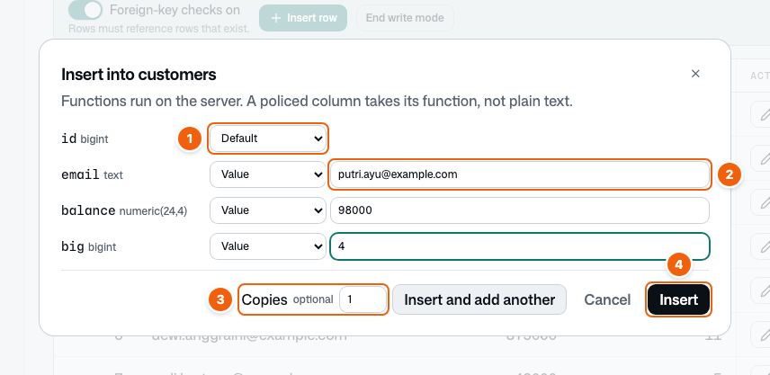

| No. | Apa ini | Yang Anda lakukan |
| --- | --- | --- |
| 1 | Jenis nilai | **Value**: pakai yang Anda ketik. **NULL**: kosongkan. **Default**: biar database yang mengisi. **Function**: buat nilai otomatis, misalnya waktu sekarang. |
| 2 | Nilai | Ketik nilainya. |
| 3 | **Copies** (salinan) | Tambah baris yang sama beberapa kali, maksimal 50. |
| 4 | **Insert** | Simpan baris. **Insert and add another** menyimpan lalu membuka formulir kosong. |

Pakai **Default** untuk kolom ID. Database akan memberi nomor berikutnya.

### 6.2 Impor file CSV atau Excel

1. Buka database.
2. Klik **Import** pada tabel tujuan.
3. Ikuti langkah di bawah.

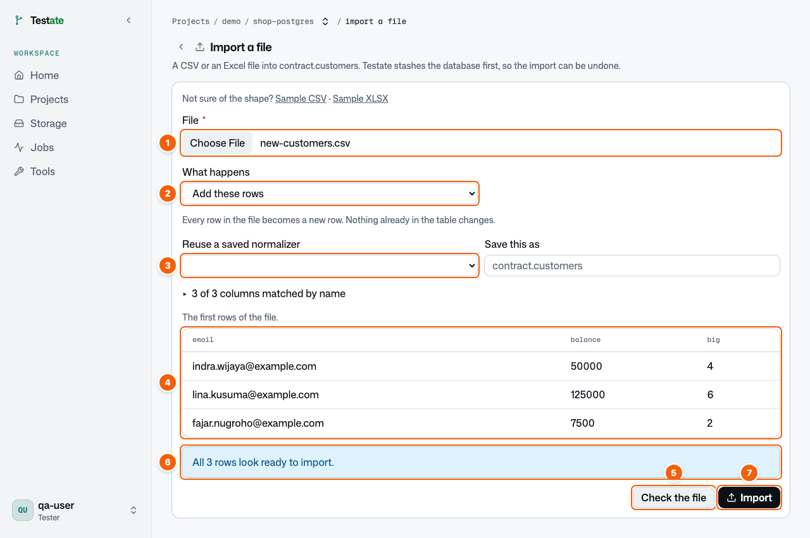

| No. | Apa ini | Yang Anda lakukan |
| --- | --- | --- |
| 1 | **File** | Pilih file `.csv` atau `.xlsx`. Ragu dengan formatnya? Klik **Sample CSV** atau **Sample XLSX**. |
| 2 | **What happens** (yang terjadi) | **Add these rows**: tambah semua baris sebagai baris baru. **Add new rows, update existing ones**: perbarui baris dengan kunci yang sama. **Clear the table, then load this file**: hapus semua baris dulu. |
| 3 | **Reuse a saved normalizer** | Normalizer adalah pasangan kolom yang tersimpan. Pilih untuk memakainya lagi. Ketik nama di **Save this as** untuk menyimpan yang ini. |
| 4 | Pratinjau | Baris pertama file Anda. Klik **columns matched by name** untuk mengatur kolom file mana masuk ke kolom tabel mana. |
| 5 | **Check the file** | Testate memeriksa setiap baris tanpa mengubah apa pun. |
| 6 | Hasil pemeriksaan | Contoh: "All 3 rows look ready to import." (ketiga baris siap diimpor). |
| 7 | **Import** | Masukkan barisnya. Tombol ini aktif hanya setelah pemeriksaan bersih. |

Setelah impor selesai, Testate menampilkan hasilnya.

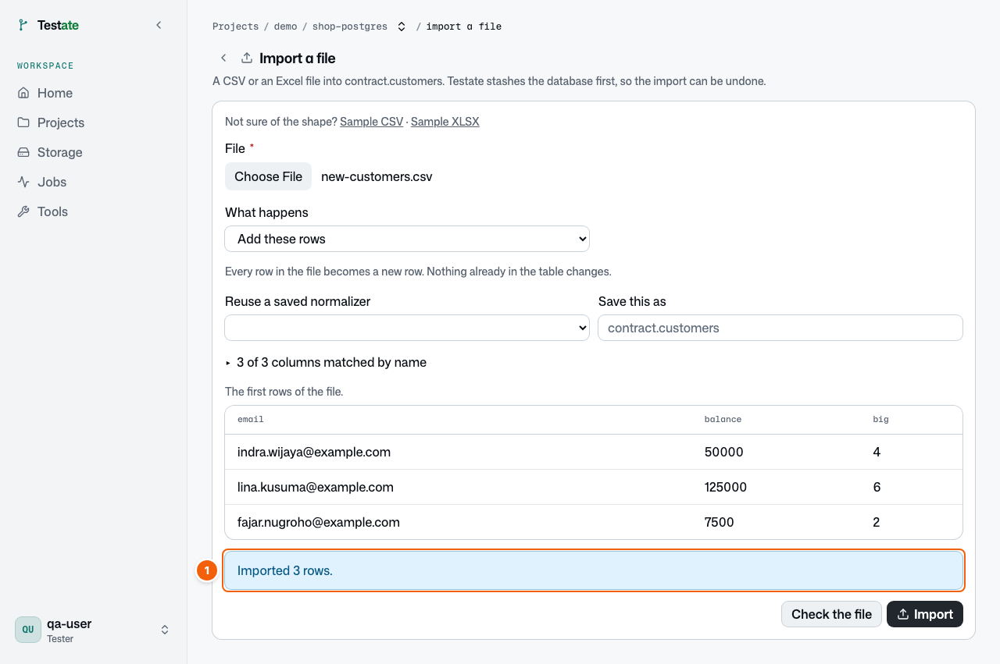

| No. | Apa ini | Yang Anda lakukan |
| --- | --- | --- |
| 1 | Hasil | Jumlah baris yang berhasil diimpor. |

Pemeriksaan tidak bisa menemukan semua masalah. Beberapa aturan, misalnya nilai ganda di kolom unik, baru terlihat saat impor sungguhan. Untuk melihat laporan, buka **Activity**, lalu **Imports**, lalu **Report**. Jika ada baris yang gagal, klik **Rejected rows** untuk mengunduhnya. Perbaiki file, lalu klik **Re-import rejected**.

## 7. Membandingkan dua titik waktu

Pakai ini untuk mencari apa saja yang diubah oleh pengujian Anda.

1. Buka tab **States**.
2. Klik **Compare**.

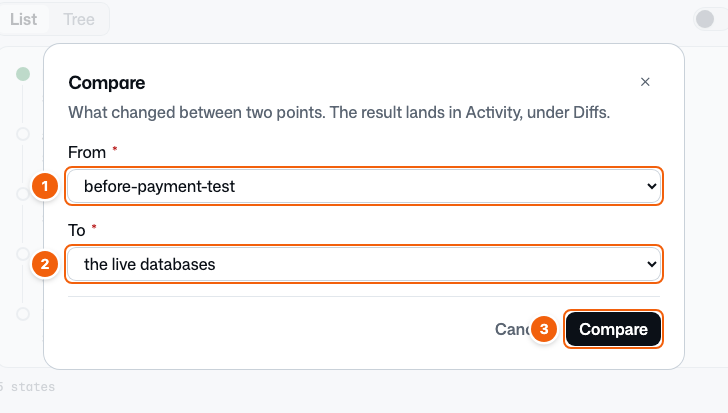

| No. | Apa ini | Yang Anda lakukan |
| --- | --- | --- |
| 1 | **From** (dari) | Pilih state yang lebih lama. |
| 2 | **To** (ke) | Pilih state yang lebih baru, atau **the live databases** untuk data saat ini. |
| 3 | **Compare** | Klik. Testate bekerja di latar belakang. |

Buka **Activity**, lalu **Diffs**.

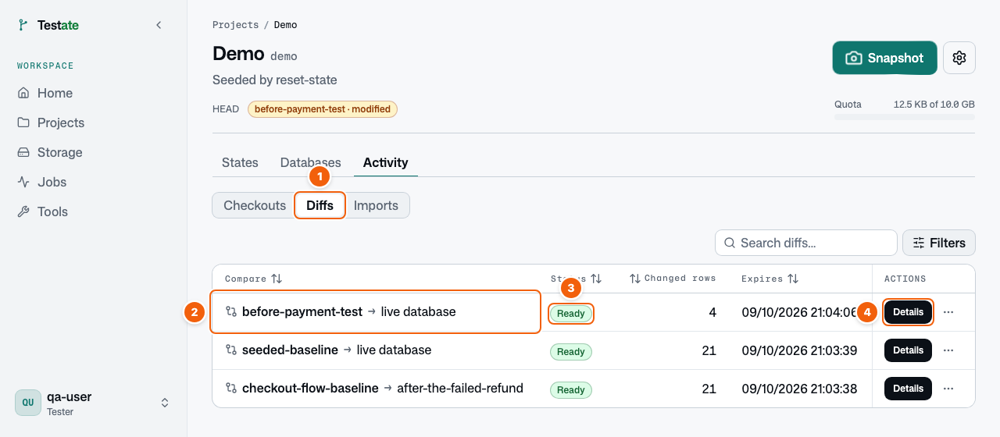

| No. | Apa ini | Yang Anda lakukan |
| --- | --- | --- |
| 1 | **Diffs** | Daftar perbandingan. |
| 2 | Compare | Apa yang dibandingkan. |
| 3 | **Status** | Tunggu sampai **Ready** (siap). **Expires** menunjukkan kapan perbandingan ini dihapus. |
| 4 | **Details** | Buka hasilnya. |

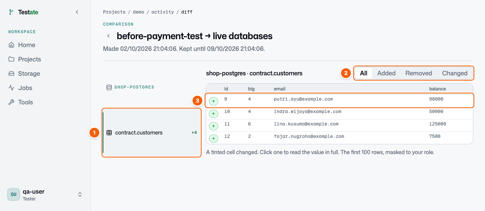

| No. | Apa ini | Yang Anda lakukan |
| --- | --- | --- |
| 1 | Tabel yang berubah | Setiap tabel yang berubah. `+4` berarti empat baris ditambah. `-2` berarti dua dihapus. `~1` berarti satu diubah. |
| 2 | **All** / **Added** / **Removed** / **Changed** | Tampilkan satu jenis perubahan saja: semua, ditambah, dihapus, atau diubah. |
| 3 | Baris | Baris `+` adalah baris baru. Baris `-` sudah hilang. Baris yang diubah tampil dua kali: versi lama (`-`) dan versi baru (`+`). Sel berwarna adalah sel yang berubah. Klik sel untuk membaca isinya lengkap. |

## 8. File

Sebagian proyek terhubung ke penyimpanan file, misalnya S3, SFTP, atau FTP. Klik **Storage** di menu samping.

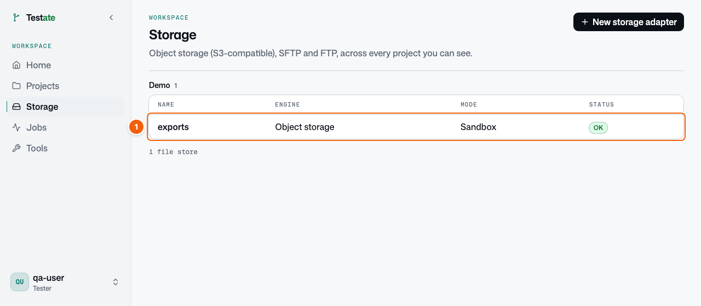

| No. | Apa ini | Yang Anda lakukan |
| --- | --- | --- |
| 1 | Penyimpanan file | Klik untuk membuka file-nya. |

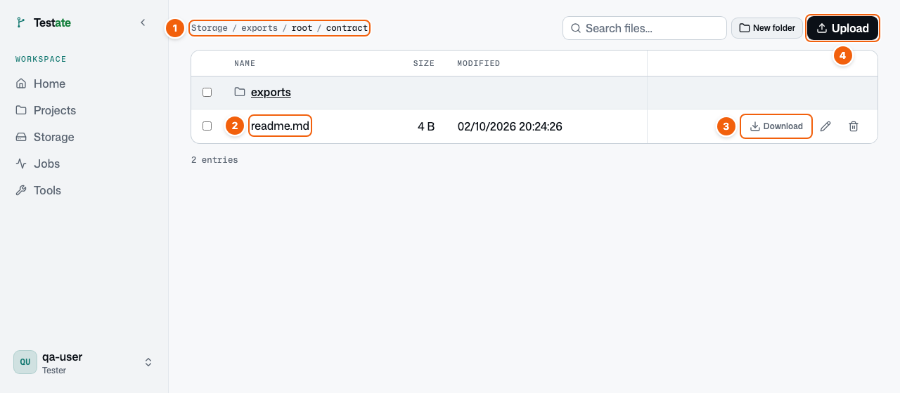

| No. | Apa ini | Yang Anda lakukan |
| --- | --- | --- |
| 1 | Lokasi | Posisi Anda sekarang. Klik bagian lokasi untuk naik kembali. |
| 2 | File | Klik untuk melihat pratinjau. Klik folder untuk membukanya. |
| 3 | **Download** | Simpan file ke komputer Anda. |
| 4 | **Upload** | Unggah file ke folder ini. **New folder** membuat folder baru. Hanya bisa di penyimpanan Sandbox. |

Penyimpanan file tidak pernah masuk ke state. Checkout tidak mengubah file Anda.

## 9. Jobs dan Tools

### 9.1 Jobs

Snapshot, checkout, perbandingan, dan impor berjalan di latar belakang. Klik **Jobs** di menu samping untuk melihatnya.

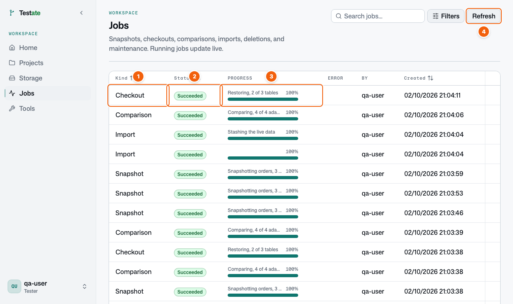

| No. | Apa ini | Yang Anda lakukan |
| --- | --- | --- |
| 1 | **Kind** (jenis) | Jenis pekerjaan, misalnya **Checkout** atau **Snapshot**. |
| 2 | **Status** | **Succeeded** (berhasil), **Running** (berjalan), atau **Failed** (gagal). |
| 3 | **Progress** (kemajuan) | Seberapa jauh pekerjaan berjalan. Kolom **Error** menjelaskan alasan pekerjaan gagal. |
| 4 | **Refresh** | Muat ulang daftar. Pekerjaan yang berjalan diperbarui sendiri. |

### 9.2 Tools

Menu **Tools** berisi tiga alat bantu kecil. **Hash** membuat hash dari sebuah nilai, misalnya password bcrypt untuk pengguna uji. **Random bytes** membuat nilai acak. **UUID v7** membuat ID baru. Testate tidak menyimpan apa pun yang Anda ketik di sini.

## 10. Menyiapkan proyek baru

Minta detail koneksi database uji ke developer lebih dulu: host, port, nama database, user, dan password.

### 10.1 Membuat proyek

1. Klik **Projects** di menu samping.
2. Klik **New project**.

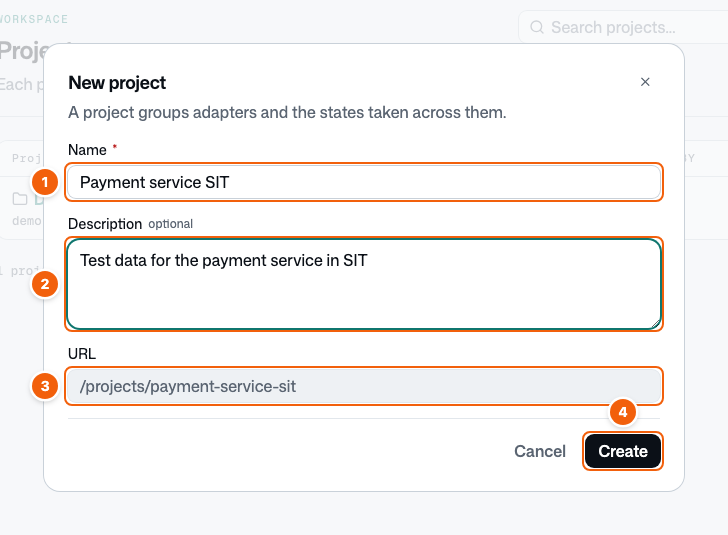

| No. | Apa ini | Yang Anda lakukan |
| --- | --- | --- |
| 1 | **Name** | Ketik nama sistem yang diuji. |
| 2 | **Description** (deskripsi) | Boleh dikosongkan. Tulis kegunaan proyek ini. |
| 3 | **URL** | Testate membuatnya dari nama. |
| 4 | **Create** (buat) | Klik. |

### 10.2 Menambah database

1. Buka proyek.
2. Buka tab **Databases**.
3. Klik **New adapter**.
4. Tempel **Connection URL**, atau isi setiap kolom.
5. Atur **Mode** ke **Sandbox**, atau **Read-only** untuk database yang tidak boleh diubah.
6. Klik **Test connection** dan baca hasilnya.
7. Klik **Create**.

Testate menyimpan starting point database baru itu. Untuk database besar, ini bisa butuh waktu.

> **Catatan:** Tombol **New adapter** hanya muncul saat proyek berada di starting point. Jika Anda melihat pesan seperti di [bagian 5.1](#51-database-dalam-proyek), klik **Check out the starting point** dulu.

## 11. Jika terjadi masalah

| Yang Anda lihat | Artinya | Yang Anda lakukan |
| --- | --- | --- |
| HEAD bertuliskan **modified** | Data live berubah setelah snapshot atau checkout terakhir. | Biarkan jika memang diharapkan. Checkout sebuah state untuk mengembalikan. |
| HEAD bertuliskan **unknown** | Checkout berhenti sebelum semua database selesai. | Buka **Activity**, lalu **Checkouts**. Klik **Retry**. |
| Jendela checkout menunjukkan perbedaan skema | Seseorang mengubah susunan tabel, misalnya setelah deploy. Testate menghentikan checkout. | Tanyakan perubahannya ke developer. Nyalakan **Force past schema drift** hanya jika Anda menerima pemulihan sebagian. Testate lalu hanya memulihkan tabel dan kolom yang ada di kedua sisi. |
| Checkout gagal karena lock timeout | Aplikasi sedang mengunci tabel. Testate menunjukkan sesi yang menghalangi. | Hentikan aplikasi, atau selesaikan pekerjaan yang terbuka. Lalu klik **Retry**. |
| **Counters** gagal | Baris baru bisa mendapat ID yang sudah dipakai. | Klik **Counters** pada checkout itu untuk memperbaikinya. |
| **Write mode** tidak muncul | Database Read-only, database MongoDB, atau tabel tidak punya primary key. | Pakai database Sandbox dengan tabel yang punya primary key. |
| **Import** tetap tidak aktif | Pemeriksaan menemukan baris bermasalah. | Baca hasil pemeriksaan. Perbaiki file. Klik **Check the file** lagi. |
| Bar quota penuh | State Anda memakai seluruh ruang proyek. | Hapus state lama yang tidak dilindungi. |
| Pekerjaan berstatus **Failed** | Pekerjaan tidak selesai. | Buka **Jobs** dan baca kolom **Error**. Tunjukkan ke administrator jika kurang jelas. |
| Tidak bisa masuk | Lima kali salah password, atau akun Anda dinonaktifkan. | Tunggu 15 menit, atau hubungi administrator. |

## 12. Hal yang hanya dilakukan administrator

Tester tidak bisa membuka layar berikut. Minta administrator untuk:

- membuat akun baru atau mengatur ulang password,
- token API untuk pipeline atau agen AI,
- catatan audit,
- pengaturan instance, seperti quota dan masa simpan data,
- aturan penyamaran (masking) kolom.
